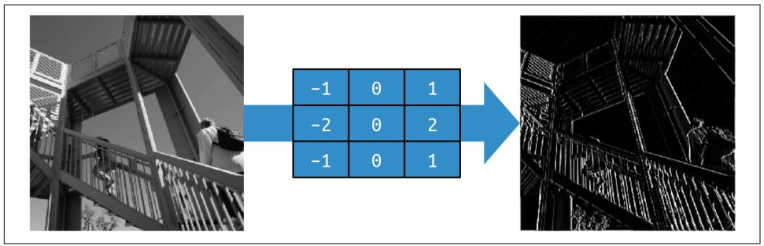
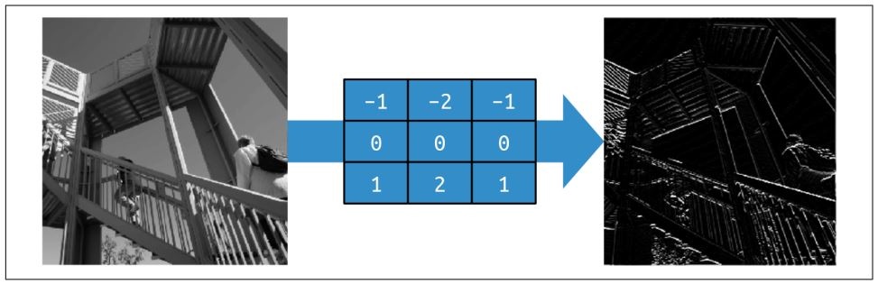
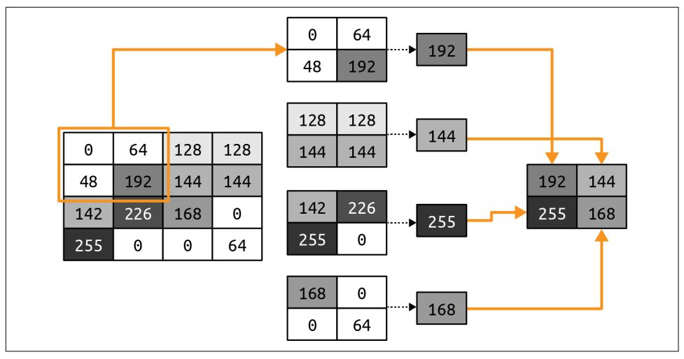
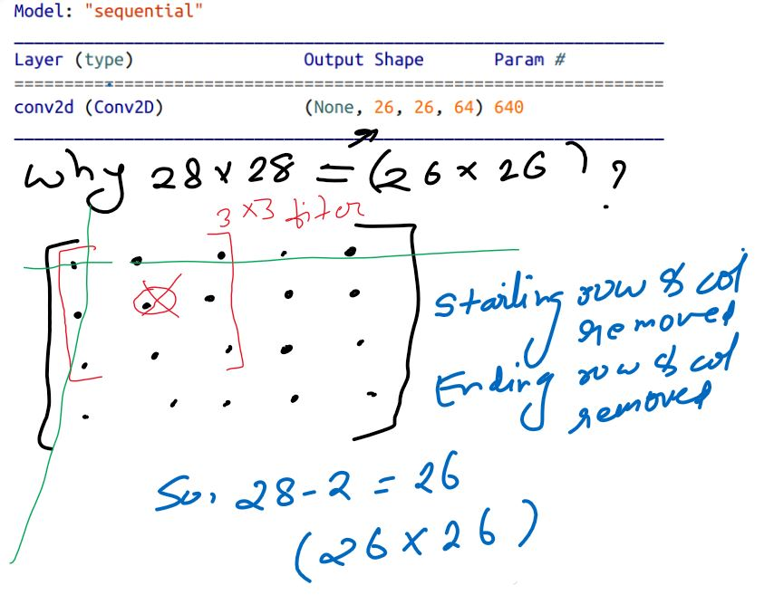
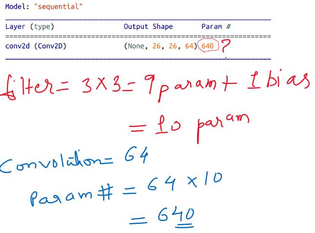
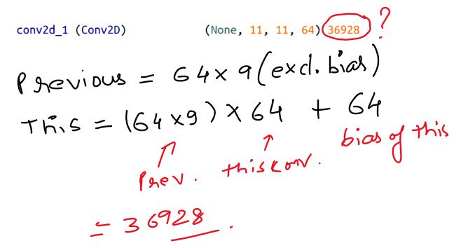
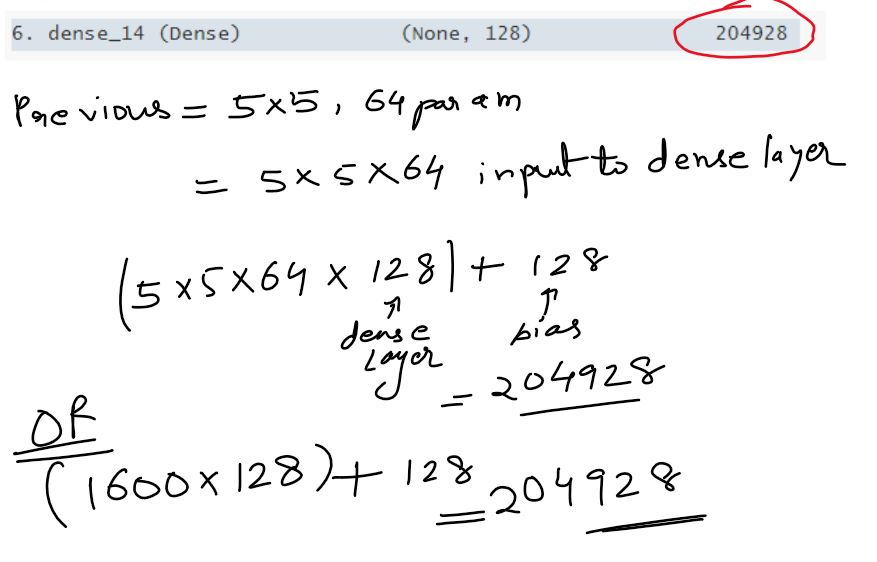
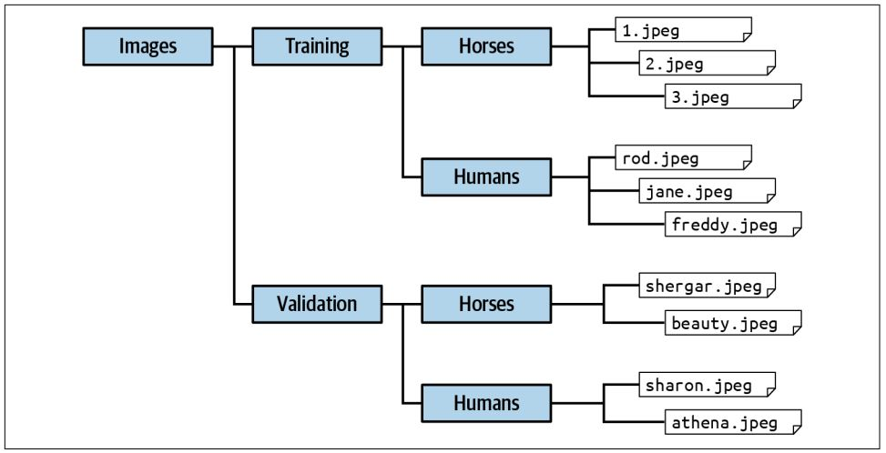

# AI and Machine Learning for Coders

This book is divided into two parts:

**I. Building Models**

**II. Using Models**


[TOC]

# Building Models

## Chapter 1 -  Introduction to Tensor Flow

### Get Started with ML

```python
import tensorflow as tf
import numpy as np
from tensorflow.keras import Sequential
from tensorflow.keras.layers import Dense

# Dataset
xs = np.array([-1.0, 0.0, 1.0, 2.0, 3.0, 4.0], dtype=float)
ys = np.array([-3.0, -1.0, 1.0, 3.0, 5.0, 7.0], dtype=float)

# Create Layer
layer0 = Dense(units=1, input_shape=[1])

# Create Model
model = Sequential(layer0)

# Compile Model
model.compile(optimizer='sgd', loss='mean_squared_error')

# Fit the model
model.fit(xs, ys, epochs=500)

# Prediction
model.predict([10.0])

# Get weights of layer
print(layer0.get_weights())
```

**Layer weight output**

```python
[array([[1.9975563]], dtype=float32), array([-0.99242365], dtype=float32)]
```

The above output shows the relationship between xs and ys datasets.

`ys = 1.99 xs - 0.99`


## Chapter 2 - Introduction to Computer Vision

### Fashion MNIST Data - Recognizing Clothing Items

```python
import tensorflow as tf

# Download Dataset
data = tf.keras.datasets.fashion_mnist

# Read Dataset
(training_images, training_labels), (test_images, test_labels) = data.load_data()

training_images.shape 
# (60000, 28, 28)

# Normalizing the image
training_images = training_images / 255.0
test_images = test_images / 255.0
    
#  Flatten takes that “square” value (a 2D array) and turns it into a line (a 1D array).
model = tf.keras.models.Sequential([
           tf.keras.layers.Flatten(input_shape=(28, 28)),
           tf.keras.layers.Dense(128, activation=tf.nn.relu),
           tf.keras.layers.Dense(10, activation=tf.nn.softmax),
           ])

# sparse_categorical_crossentropy => Instead of us trying to predict a single number, here we’re picking a category.
# The adam optimizer is an evolution of the stochastic gradient descent (sgd) optimizer .
model.compile(optimizer='adam', loss='sparse_categorical_crossentropy', metrics=['accuracy'])

model.fit(training_images, training_labels, epochs=5)

# Model evaluation for test test
model.evaluate(test_images, test_labels)
# 313/313 [==============================] - 1s 1ms/step - loss: 0.3625 - accuracy: 0.8728
# [0.3625304698944092, 0.8727999925613403]

# Model prediction
classification = model.predict(test_images)

print(classification[0], test_labels[0])
# [7.5722205e-08 9.0681178e-09 3.5207063e-07 3.0455332e-08 7.9662385e-08
# 4.6717711e-03 5.6379696e-07 7.7662379e-02 8.5741232e-07 9.1766393e-01] 
# 9
```


### Stop training automatically

```python
# Define Callback
class Callback(tf.keras.callbacks.Callback):
  def on_epoch_end(self, epoch, logs={}):
    if(logs.get('accuracy') > 95):
      print("\n Reached 95% accuracy so cancelling training!")
      self.model.stop_training = True

# Create object
mycallback = Callback()

# While fiting pass the callback object
model.fit(training_images, training_labels, epochs=50, callbacks=[mycallback])
```


## Chapter 3 - Detecting Features in Images 

### Filters

Another word for the filters is a convolution, and by using these in a neural network we can create a convolutional neural network (CNN).  

### Convolution

A convolution is simply a filter of weights that are used to multiply a pixel with its neighbors to get a new value for the pixel.

The below figures shows the filter to get vertical and horizontal lines.





### Pooling

Pooling is the process of eliminating pixels in your image while maintaining the semantics of the content within the image. The pixels on the left are reduced by 75% (from 16 to 4), with the maximum

 value from each pool making up the new image.    

Below figure shows max pooling.



```python
import tensorflow as tf

# Download dataset
data = tf.keras.datasets.fashion_mnist

# Load dataset
(training_images, training_labels), (test_images, test_labels) = data.load_data()

# NOTE:
# because Conv2D layers are designed for multicolor images, we’re specifying the third
# dimension as 1, so our input shape is 28 × 28 × 1. Color images will typically have a 3
# as the third parameter as they are stored as values of R, G, and B.

training_images = training_images.reshape(60000, 28, 28, 1)
# Normalization
training_images = training_images / 255.0

test_images = test_images.reshape(10000, 28, 28, 1)
# Normalization
test_images = test_images / 255.0

# 64 Convolutions are randomly initialized.
# (3, 3) is the size of the filter.

model = tf.keras.models.Sequential([
        tf.keras.layers.Conv2D(64, (3,3), activation='relu', input_shape=(28, 28, 1)),
        tf.keras.layers.MaxPooling2D(2,2),
        tf.keras.layers.Conv2D(64, (3, 3), activation='relu'),
        tf.keras.layers.MaxPooling2D(2,2),
        tf.keras.layers.Flatten(),
        tf.keras.layers.Dense(128, activation=tf.nn.relu),
        tf.keras.layers.Dense(10, activation=tf.nn.softmax)
])

model.compile(optimizer='adam', loss='sparse_categorical_crossentropy', metrics=['accuracy'])

model.fit(training_images, training_labels, epochs=10)

model.evaluate(test_images, test_labels)
```

### Exploring Model Summary

`model.summary()`

```python
Model: "sequential_7"
_________________________________________________________________
Layer (type)                 Output Shape              Param #   
=================================================================
1. conv2d (Conv2D)              (None, 26, 26, 64)        640       
_________________________________________________________________
2. max_pooling2d (MaxPooling2D) (None, 13, 13, 64)        0         
_________________________________________________________________
3. conv2d_1 (Conv2D)            (None, 11, 11, 64)        36928     
_________________________________________________________________
4. max_pooling2d_1 (MaxPooling2 (None, 5, 5, 64)          0         
_________________________________________________________________
5. flatten_7 (Flatten)          (None, 1600)              0         
_________________________________________________________________
6. dense_14 (Dense)             (None, 128)               204928    
_________________________________________________________________
7 dense_15 (Dense)             (None, 10)                1290      
=================================================================
Total params: 243,786
Trainable params: 243,786
Non-trainable params: 0
_________________________________________________________________
```

#### 1. conv2d

Our first layer will have 28 × 28 images, and apply 64 filters to them. But because our filter is 3 × 3, a 1-pixel border around the image will be lost, reducing our overall information to 26 × 26 pixels.  



An image that is A × B pixels in shape when run through a 3 × 3 filter will become (A–2) × (B–2) pixels in shape. Similarly, a 5 × 5 filter would make it (A–4) × (B–4), and so on. As we’re using a 28 × 28 image and a 3 × 3 filter, our output will now be 26 × 26.  

#### 2. max_pooling2d

After that the pooling layer is 2 × 2, so the size of the image will halve on each axis, and it will then become (13 × 13).   

#### 3. max_pooling2d

After that the pooling layer is 2 × 2, so the size of the image will halve on each axis, and it will then become (13 × 13).   

and **so on...**

#### 4. Parameters



* The MaxPooling layers don’t learn anything, they just reduce the image, so there are no learned parameters there—hence 0 being reported.  






* Our final dense layer of 10 neurons takes in the output of the previous 128, so the number of parameters learned will be (128 × 10) + 10, which is 1,290.  

**NOTE: Training this network requires us to learn the best set of these 243,786 parameters to match the input images to their labels.**  


### Horses or Human - more complex dataset

* With Keras in TensorFlow, a tool called the **ImageDataGenerator** can use the structure to automatically assign labels to images. 
* To use the **ImageDataGenerator**, you simply ensure that your directory structure has a set of named subdirectories, with each subdirectory being a label.   




#### Dataset Preprocessing

```python
from tensorflow.keras.preprocessing.image import ImageDataGenerator

# Training directory location
training_dir = 'horse-or-human/training/'
# Recale all images
train_datagen = ImageDataGenerator(rescale=1/255)

train_datagen.flow_from_directory(
    training_dir,
    target_size=(300, 300),
    class_mode='binary'
)
```


#### Coding

```python
import urllib.request
import zipfile

url = "https://storage.googleapis.com/laurencemoroney-blog.appspot.com/horse-or-human.zip"
file_name = "horse-or-human.zip"
training_dir = 'horse-or-human/training/'
urllib.request.urlretrieve(url, file_name)
zip_ref = zipfile.ZipFile(file_name, 'r')
zip_ref.extractall(training_dir)
zip_ref.close()

validation_url = "https://storage.googleapis.com/laurencemoroney-blog.appspot.com/validation-horse-or-human.zip"
validation_file_name = "validation-horse-or-human.zip"
validation_dir = 'horse-or-human/validation/'
urllib.request.urlretrieve(validation_url, validation_file_name)
zip_ref = zipfile.ZipFile(validation_file_name, 'r')
zip_ref.extractall(validation_dir)
zip_ref.close()

from tensorflow.keras.preprocessing.image import ImageDataGenerator
import tensorflow as tf

# All images will be rescaled by 1./255
train_datagen = ImageDataGenerator(rescale=1/255)
train_generator = train_datagen.flow_from_directory(
training_dir,
target_size=(300, 300),
class_mode='binary'
)

validation_datagen = ImageDataGenerator(rescale=1/255)
validation_generator = train_datagen.flow_from_directory(
validation_dir,
target_size=(300, 300),
class_mode='binary'
)

model = tf.keras.models.Sequential([
          tf.keras.layers.Conv2D(16, (3,3), activation='relu', input_shape=(300, 300, 3)),
          tf.keras.layers.MaxPooling2D(2, 2),
          tf.keras.layers.Conv2D(32, (3,3), activation='relu'),
          tf.keras.layers.MaxPooling2D(2,2),
          tf.keras.layers.Conv2D(64, (3,3), activation='relu'),
          tf.keras.layers.MaxPooling2D(2,2),
          tf.keras.layers.Conv2D(64, (3,3), activation='relu'),
          tf.keras.layers.MaxPooling2D(2,2),
          tf.keras.layers.Conv2D(64, (3,3), activation='relu'),
          tf.keras.layers.MaxPooling2D(2,2),
          tf.keras.layers.Flatten(),
          tf.keras.layers.Dense(512, activation='relu'),
          tf.keras.layers.Dense(1, activation='sigmoid')
])

# learning rate (lr)
from tensorflow.keras.optimizers import RMSprop
model.compile(loss='binary_crossentropy', optimizer=RMSprop(learning_rate=0.001), metrics=['accuracy'])

history = model.fit_generator(
  train_generator,
  epochs=5,
  validation_data=validation_generator
)

# Predicting Images
from keras.preprocessing import image
import numpy as np

# The images being uploaded can be any shape, 
# but if we are going to feed them into the model, they must be 300 × 300.
img = image.load_img('/content/hu1.jpg', target_size=(300,300))
x = image.img_to_array(img)

# The model, however,
# expects a 3D array, as indicated by the input_shape in the model architecture. Fortu‐
# nately, Numpy provides an expand_dims method that handles this and allows us to
# easily add a new dimension to the array.
x = np.expand_dims(x, axis=0)

# Now that we have our image in a 3D array, we just want to make sure that it’s stacked
# vertically so that it is in the same shape as the training data:
image_tensor = np.vstack([x])

output_class = model.predict(image_tensor)

if output_class[0]>0.5:
  print("It is a human")
else:
  print("It is a horse")
```


### Image Augmentation

* We built a horse-or-human classifier model that was trained on a relatively small dataset .
* As a result, you soon began to hit problems classifying some previously unseen images, such as the miscategorization of a woman with a horse because the training set didn’t include any images of people in that pose.  
* One way to deal with such problems is with **image augmentation**.  
* The idea behind this technique is that, as TensorFlow is loading your data, it can create additional new data by amending what it has using a number of transforms. 

```python
train_datagen = ImageDataGenerator(
    rescale=1./255,
    rotation_range=40,
    width_shift_range=0.2,
    height_shift_range=0.2,
    shear_range=0.2,
    zoom_range=0.2,
    horizontal_flip=True,
    fill_mode='nearest'
)
```

Here, as well as rescaling the image to normalize it, you’re also doing the following:
• Rotating each image randomly up to 40 degrees left or right
• Translating the image up to 20% vertically or horizontally
• Shearing the image by up to 20%
• Zooming the image by up to 20%
• Randomly flipping the image horizontally or vertically
• Filling in any missing pixels after a move or shear with nearest neighbors 

**USE CASE: In thiscase, when training with these augmentations my accuracy went down from 99% to 85% after 15 epochs, with validation slightly higher at 89%. (This indicates that the model is underfitting slightly, so the parameters could be tweaked a bit.)**  

### Transfer Learning

Another technique to improve the model is to use features that were already learned elsewhere. Many researchers with massive resources (millions of  images) and huge models that have been trained on thousands of classes have shared their models, and using a concept called ***transfer learning*** you can use the features those models learned and apply them to your data.   

The idea behind transfer learning is simple: instead of learning a set of filters from scratch for our dataset, why not use a set of filters that were learned on a much larger dataset, with many more features than we can “afford” to build from scratch? We can place these in our network and then train a model with our data using the prelearned filters.   

Google, which is trained on more than a million images from a data‐base called **ImageNet**. It has dozens of layers and can classify images into one thousand categories. A saved model is available containing the pretrained weights. To use this, we simply download the weights, create an instance of the Inception V3 architecture, and then load the weights into this architecture like this:  

`InceptionV3 - This function returns a Keras image classification model, optionally loaded with weights pre-trained on ImageNet.`

**STEP 01**

```python
from tensorflow.keras.applications.inception_v3 import InceptionV3
weights_url = "https://storage.googleapis.com/mledudatasets/inception_v3_weights_tf_dim_ordering_tf_kernels_notop.h5"
weights_file = "inception_v3.h5"
urllib.request.urlretrieve(weights_url, weights_file)
pre_trained_model = InceptionV3(input_shape=(150, 150, 3),
    include_top=False,
    weights=None)
    pre_trained_model.load_weights(weights_file
)
    
pre_trained_model.summary()
```

**STEP 02**

Next, we’ll freeze the entire network from retraining and then set a variable to point at mixed7’s output as where we want to crop the network up to.   

```python
for layer in pre_trained_model.layers:
    layer.trainable = False
    
last_layer = pre_trained_model.get_layer('mixed7')
print('last layer output shape: ', last_layer.output_shape)
last_output = last_layer.output
```

**STEP 03**

Add our dense layers underneath.

```python
# Flatten the output layer to 1 dimension
x = layers.Flatten()(last_output)
# Add a fully connected layer with 1,024 hidden units and ReLU activation
x = layers.Dense(1024, activation='relu')(x)
# Add a final sigmoid layer for classification
x = layers.Dense(1, activation='sigmoid')(x)
```

**STEP 04**

```python
model = Model(pre_trained_model.input, x)
model.compile(optimizer=RMSprop(lr=0.0001),
loss='binary_crossentropy',
metrics=['acc'])
```


### Multiclass Classification

```python
# Download Dataset
!wget --no-check-certificate \
https://storage.googleapis.com/laurencemoroney-blog.appspot.com/rps.zip \
-O /tmp/rps.zip
local_zip = '/tmp/rps.zip'
zip_ref = zipfile.ZipFile(local_zip, 'r')
zip_ref.extractall('/tmp/')
zip_ref.close()
TRAINING_DIR = "/tmp/rps/"
training_datagen = ImageDataGenerator(
  rescale = 1./255,
  rotation_range=40,
  width_shift_range=0.2,
  height_shift_range=0.2,
  shear_range=0.2,
  zoom_range=0.2,
  horizontal_flip=True,
  fill_mode='nearest'
)

# dataset generator
train_generator = training_datagen.flow_from_directory(
    TRAINING_DIR,
    target_size=(150,150),
    class_mode='categorical'
)
#Found 2520 images belonging to 3 classes.

# Model
model = tf.keras.models.Sequential([
  # Note the input shape is the desired size of the image:
  # 150x150 with 3 bytes color
  # This is the first convolution
  tf.keras.layers.Conv2D(64, (3,3), activation='relu',
  input_shape=(150, 150, 3)),
  tf.keras.layers.MaxPooling2D(2, 2),
  # The second convolution
  tf.keras.layers.Conv2D(64, (3,3), activation='relu'),
  tf.keras.layers.MaxPooling2D(2,2),
  # The third convolution
  tf.keras.layers.Conv2D(128, (3,3), activation='relu'),
  tf.keras.layers.MaxPooling2D(2,2),
  # The fourth convolution
  tf.keras.layers.Conv2D(128, (3,3), activation='relu'),
  tf.keras.layers.MaxPooling2D(2,2),
  # Flatten the results to feed into a DNN
  tf.keras.layers.Flatten(),
  # 512 neuron hidden layer
  tf.keras.layers.Dense(512, activation='relu'),
  tf.keras.layers.Dense(3, activation='softmax')
])

# Compile
model.compile(loss = 'categorical_crossentropy', optimizer='rmsprop', metrics=['accuracy'])

# Fit
history = model.fit(train_generator, epochs=10, validation_data = validation_generator, verbose = 1)

# Prediction
# Note also that when using the ImageDataGenerator, the classes are loaded in alpha‐
# betical order—so while you might expect the output neurons to be in the order of the
# name of the game, the order in fact will be Paper, Rock, Scissors.

img = image.load_img(path, target_size=(150, 150)) 
x = image.img_to_array(img)
x = np.expand_dims(x, axis=0)
images = np.vstack([x])
classes = model.predict(images, batch_size=10)
print(classes) # [1. 0. 0.]

# To get the labels of the classes
labels = (train_generator.class_indices)
```


### Dropout Regularization 

Overfitting, where a network may become too specialized in a particular type of input data and fare poorly on others. One technique to help overcome this is use of dropout regularization.

When a neural network is being trained, each individual neuron will have an effect on neurons in subsequent layers. Over time, particularly in larger networks, some neurons can become overspecialized—and that feeds downstream, potentially causing the network as a whole to become overspecialized and leading to overfitting. Additionally, neighboring neurons can end up with similar weights and biases, and if not monitored this can lead the overall model to become overspecialized to the features activated by those neurons.  

While training, if you remove a random number of neurons and ignore them, their contribution to the neurons in the next layer is temporarily blocked . This reduces the chances of the neurons becoming overspecialized. 

```python
model = tf.keras.models.Sequential([
    tf.keras.layers.Flatten(input_shape=(28,28)),
    tf.keras.layers.Dense(256, activation=tf.nn.relu),
    tf.keras.layers.Dropout(0.2), # DROPOUT 20% of neurons.
    tf.keras.layers.Dense(128, activation=tf.nn.relu),
    tf.keras.layers.Dropout(0.2), # DROPOUT
    tf.keras.layers.Dense(64, activation=tf.nn.relu),
    tf.keras.layers.Dropout(0.2), # DROPOUT
    tf.keras.layers.Dense(10, activation=tf.nn.softmax)
])
```

