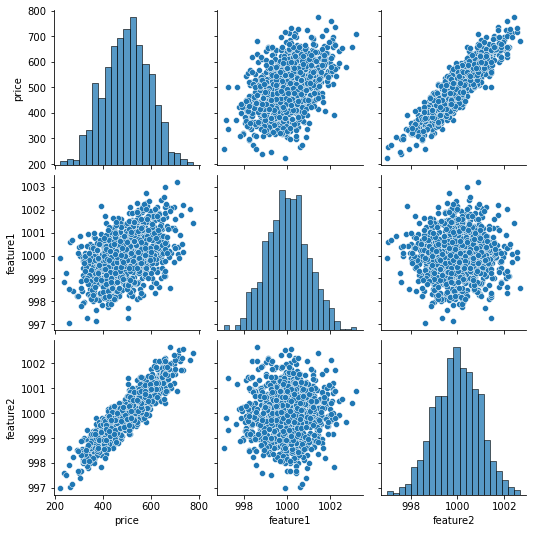
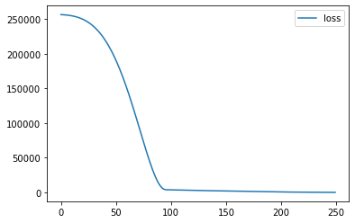
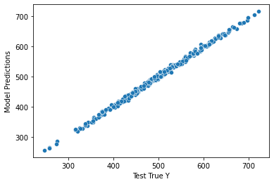

```python
import numpy as np
import pandas as pd
import seaborn as sns
```

# Part 1 - Data Preprocessing


```python
df = pd.read_csv('fake_reg.csv')
df.head()
```


<div>
<style scoped>
    .dataframe tbody tr th:only-of-type {
        vertical-align: middle;
    }

    .dataframe tbody tr th {
        vertical-align: top;
    }

    .dataframe thead th {
        text-align: right;
    }
</style>
<table border="1" class="dataframe">
  <thead>
    <tr style="text-align: right;">
      <th></th>
      <th>price</th>
      <th>feature1</th>
      <th>feature2</th>
    </tr>
  </thead>
  <tbody>
    <tr>
      <th>0</th>
      <td>461.527929</td>
      <td>999.787558</td>
      <td>999.766096</td>
    </tr>
    <tr>
      <th>1</th>
      <td>548.130011</td>
      <td>998.861615</td>
      <td>1001.042403</td>
    </tr>
    <tr>
      <th>2</th>
      <td>410.297162</td>
      <td>1000.070267</td>
      <td>998.844015</td>
    </tr>
    <tr>
      <th>3</th>
      <td>540.382220</td>
      <td>999.952251</td>
      <td>1000.440940</td>
    </tr>
    <tr>
      <th>4</th>
      <td>546.024553</td>
      <td>1000.446011</td>
      <td>1000.338531</td>
    </tr>
  </tbody>
</table>
</div>


```python
sns.pairplot(df)
```


    <seaborn.axisgrid.PairGrid at 0x25900da4ac0>


    

    


```python
from sklearn.model_selection import train_test_split
```


```python
X = df[['feature1', 'feature2']].values
```


```python
y = df['price'].values
```


```python
X_train, X_test, y_train, y_test = train_test_split(X, y, test_size=0.3, random_state=42)
```


```python
X_train.shape
```


    (700, 2)


```python
X_test.shape
```


    (300, 2)


```python
y_train.shape
```


    (700,)


```python
y_test.shape
```


    (300,)


```python
# Data Scaling
from sklearn.preprocessing import MinMaxScaler
```


```python
scaler = MinMaxScaler()
```


```python
scaler.fit(X_train) # Scale only training set
X_train = scaler.transform(X_train)
X_test = scaler.transform(X_test) # do not cheat
```


```python
X_train[:10]
```


    array([[0.74046017, 0.32583248],
           [0.43166001, 0.2555088 ],
           [0.18468554, 0.70500664],
           [0.52955895, 0.93551377],
           [0.52907398, 0.39249753],
           [0.39193092, 0.59987473],
           [0.44645598, 0.68757421],
           [0.4273008 , 0.48791166],
           [0.43221954, 0.599139  ],
           [0.60702139, 0.60360491]])


```python
y_test[:10]
```


    array([402.29631873, 624.15619847, 582.4550663 , 578.58860646,
           371.22410361, 584.38110772, 514.40564086, 464.11587006,
           551.65009963, 451.8041724 ])


# Part 2 - Create Model


```python
from tensorflow.keras.models import Sequential
from tensorflow.keras.layers import Dense
```


```python
# model = Sequential([
#                         Dense(4, activation='relu'),
#                         Dense(2, activation='relu'),
#                         Dense(1),
                        
#                     ])

# OR
```


```python
model = Sequential()
model.add(Dense(4, activation='relu'))
model.add(Dense(4, activation='relu'))
model.add(Dense(4, activation='relu'))

model.add(Dense(1))

model.compile(optimizer='rmsprop', loss='mse')
```


```python
model.fit(x=X_train, y=y_train, epochs=250)
```

    Epoch 1/250
    22/22 [==============================] - 0s 782us/step - loss: 256678.7500
    Epoch 2/250
    22/22 [==============================] - 0s 817us/step - loss: 256588.5000
    Epoch 3/250
    22/22 [==============================] - 0s 816us/step - loss: 256493.8906
    Epoch 4/250
    22/22 [==============================] - 0s 904us/step - loss: 256384.6094
    Epoch 5/250
    22/22 [==============================] - 0s 810us/step - loss: 256253.5312
    Epoch 6/250
    22/22 [==============================] - 0s 907us/step - loss: 256097.6406
    Epoch 7/250
    22/22 [==============================] - 0s 906us/step - loss: 255917.5781
    Epoch 8/250
    22/22 [==============================] - 0s 907us/step - loss: 255709.6406
    Epoch 9/250
    22/22 [==============================] - 0s 1ms/step - loss: 255475.4688
    Epoch 10/250
    22/22 [==============================] - 0s 997us/step - loss: 255212.5781
    Epoch 11/250
    22/22 [==============================] - 0s 952us/step - loss: 254919.4219
    Epoch 12/250
    22/22 [==============================] - 0s 907us/step - loss: 254591.7969
    Epoch 13/250
    22/22 [==============================] - 0s 1ms/step - loss: 254230.1875
    Epoch 14/250
    22/22 [==============================] - 0s 833us/step - loss: 253834.2344
    Epoch 15/250
    22/22 [==============================] - 0s 952us/step - loss: 253398.0156
    Epoch 16/250
    22/22 [==============================] - 0s 903us/step - loss: 252921.4688
    Epoch 17/250
    22/22 [==============================] - 0s 952us/step - loss: 252400.1094
    Epoch 18/250
    22/22 [==============================] - 0s 905us/step - loss: 251832.3906
    Epoch 19/250
    22/22 [==============================] - 0s 905us/step - loss: 251215.1094
    Epoch 20/250
    22/22 [==============================] - 0s 944us/step - loss: 250550.1875
    Epoch 21/250
    22/22 [==============================] - 0s 997us/step - loss: 249829.6719
    Epoch 22/250
    22/22 [==============================] - 0s 1ms/step - loss: 249049.0312
    Epoch 23/250
    22/22 [==============================] - 0s 953us/step - loss: 248212.1875
    Epoch 24/250
    22/22 [==============================] - 0s 1ms/step - loss: 247312.8906
    Epoch 25/250
    22/22 [==============================] - 0s 907us/step - loss: 246354.2812
    Epoch 26/250
    22/22 [==============================] - 0s 1ms/step - loss: 245325.9688
    Epoch 27/250
    22/22 [==============================] - 0s 861us/step - loss: 244225.1250
    Epoch 28/250
    22/22 [==============================] - 0s 953us/step - loss: 243057.7812
    Epoch 29/250
    22/22 [==============================] - 0s 894us/step - loss: 241809.8438
    Epoch 30/250
    22/22 [==============================] - 0s 905us/step - loss: 240484.4375
    Epoch 31/250
    22/22 [==============================] - 0s 907us/step - loss: 239082.0312
    Epoch 32/250
    22/22 [==============================] - 0s 890us/step - loss: 237592.0625
    Epoch 33/250
    22/22 [==============================] - 0s 907us/step - loss: 236023.1250
    Epoch 34/250
    22/22 [==============================] - 0s 907us/step - loss: 234362.9062
    Epoch 35/250
    22/22 [==============================] - 0s 831us/step - loss: 232607.6094
    Epoch 36/250
    22/22 [==============================] - 0s 997us/step - loss: 230759.2031
    Epoch 37/250
    22/22 [==============================] - 0s 1ms/step - loss: 228820.1562
    Epoch 38/250
    22/22 [==============================] - 0s 1ms/step - loss: 226782.7656
    Epoch 39/250
    22/22 [==============================] - 0s 907us/step - loss: 224640.8750
    Epoch 40/250
    22/22 [==============================] - 0s 1ms/step - loss: 222393.5781
    Epoch 41/250
    22/22 [==============================] - 0s 906us/step - loss: 220055.7969
    Epoch 42/250
    22/22 [==============================] - 0s 952us/step - loss: 217589.7812
    Epoch 43/250
    22/22 [==============================] - 0s 771us/step - loss: 215021.1875
    Epoch 44/250
    22/22 [==============================] - 0s 861us/step - loss: 212357.0312
    Epoch 45/250
    22/22 [==============================] - 0s 861us/step - loss: 209573.3438
    Epoch 46/250
    22/22 [==============================] - 0s 861us/step - loss: 206663.0781
    Epoch 47/250
    22/22 [==============================] - 0s 816us/step - loss: 203659.2656
    Epoch 48/250
    22/22 [==============================] - 0s 861us/step - loss: 200518.7188
    Epoch 49/250
    22/22 [==============================] - 0s 861us/step - loss: 197275.3125
    Epoch 50/250
    22/22 [==============================] - 0s 861us/step - loss: 193916.6875
    Epoch 51/250
    22/22 [==============================] - 0s 815us/step - loss: 190440.2344
    Epoch 52/250
    22/22 [==============================] - 0s 907us/step - loss: 186842.0469
    Epoch 53/250
    22/22 [==============================] - 0s 996us/step - loss: 183146.7344
    Epoch 54/250
    22/22 [==============================] - 0s 885us/step - loss: 179320.5312
    Epoch 55/250
    22/22 [==============================] - 0s 1ms/step - loss: 175373.0469
    Epoch 56/250
    22/22 [==============================] - 0s 954us/step - loss: 171326.8750
    Epoch 57/250
    22/22 [==============================] - 0s 952us/step - loss: 167157.2500
    Epoch 58/250
    22/22 [==============================] - 0s 952us/step - loss: 162856.8750
    Epoch 59/250
    22/22 [==============================] - 0s 907us/step - loss: 158460.3125
    Epoch 60/250
    22/22 [==============================] - 0s 861us/step - loss: 153984.9219
    Epoch 61/250
    22/22 [==============================] - 0s 797us/step - loss: 149377.0781
    Epoch 62/250
    22/22 [==============================] - 0s 767us/step - loss: 144693.1719
    Epoch 63/250
    22/22 [==============================] - 0s 819us/step - loss: 139925.6406
    Epoch 64/250
    22/22 [==============================] - 0s 771us/step - loss: 135037.5469
    Epoch 65/250
    22/22 [==============================] - 0s 776us/step - loss: 130094.2500
    Epoch 66/250
    22/22 [==============================] - 0s 808us/step - loss: 125071.9219
    Epoch 67/250
    22/22 [==============================] - 0s 760us/step - loss: 119967.7266
    Epoch 68/250
    22/22 [==============================] - 0s 750us/step - loss: 114798.5234
    Epoch 69/250
    22/22 [==============================] - 0s 819us/step - loss: 109579.1562
    Epoch 70/250
    22/22 [==============================] - 0s 752us/step - loss: 104346.6641
    Epoch 71/250
    22/22 [==============================] - 0s 777us/step - loss: 99042.5625
    Epoch 72/250
    22/22 [==============================] - 0s 788us/step - loss: 93752.1562
    Epoch 73/250
    22/22 [==============================] - 0s 795us/step - loss: 88413.3359
    Epoch 74/250
    22/22 [==============================] - 0s 810us/step - loss: 83094.3438
    Epoch 75/250
    22/22 [==============================] - 0s 908us/step - loss: 77800.0703
    Epoch 76/250
    22/22 [==============================] - 0s 861us/step - loss: 72510.7891
    Epoch 77/250
    22/22 [==============================] - 0s 861us/step - loss: 67266.6406
    Epoch 78/250
    22/22 [==============================] - 0s 861us/step - loss: 62106.1211
    Epoch 79/250
    22/22 [==============================] - 0s 861us/step - loss: 57031.2500
    Epoch 80/250
    22/22 [==============================] - 0s 861us/step - loss: 52011.5156
    Epoch 81/250
    22/22 [==============================] - 0s 816us/step - loss: 47139.1445
    Epoch 82/250
    22/22 [==============================] - 0s 818us/step - loss: 42410.4023
    Epoch 83/250
    22/22 [==============================] - 0s 799us/step - loss: 37815.1484
    Epoch 84/250
    22/22 [==============================] - 0s 763us/step - loss: 33392.0117
    Epoch 85/250
    22/22 [==============================] - 0s 789us/step - loss: 29199.9277
    Epoch 86/250
    22/22 [==============================] - 0s 735us/step - loss: 25236.8945
    Epoch 87/250
    22/22 [==============================] - 0s 772us/step - loss: 21527.6738
    Epoch 88/250
    22/22 [==============================] - 0s 725us/step - loss: 18097.3945
    Epoch 89/250
    22/22 [==============================] - 0s 798us/step - loss: 14969.5342
    Epoch 90/250
    22/22 [==============================] - 0s 771us/step - loss: 12182.1758
    Epoch 91/250
    22/22 [==============================] - 0s 771us/step - loss: 9797.0449
    Epoch 92/250
    22/22 [==============================] - 0s 727us/step - loss: 7823.5527
    Epoch 93/250
    22/22 [==============================] - 0s 771us/step - loss: 6222.0107
    Epoch 94/250
    22/22 [==============================] - 0s 771us/step - loss: 5044.9512
    Epoch 95/250
    22/22 [==============================] - 0s 771us/step - loss: 4286.0605
    Epoch 96/250
    22/22 [==============================] - 0s 771us/step - loss: 3918.0935
    Epoch 97/250
    22/22 [==============================] - 0s 771us/step - loss: 3794.6118
    Epoch 98/250
    22/22 [==============================] - 0s 760us/step - loss: 3744.3015
    Epoch 99/250
    22/22 [==============================] - 0s 816us/step - loss: 3705.6389
    Epoch 100/250
    22/22 [==============================] - 0s 861us/step - loss: 3668.8594
    Epoch 101/250
    22/22 [==============================] - 0s 816us/step - loss: 3632.8333
    Epoch 102/250
    22/22 [==============================] - 0s 817us/step - loss: 3592.1128
    Epoch 103/250
    22/22 [==============================] - 0s 816us/step - loss: 3556.1272
    Epoch 104/250
    22/22 [==============================] - 0s 771us/step - loss: 3516.2175
    Epoch 105/250
    22/22 [==============================] - 0s 816us/step - loss: 3483.0867
    Epoch 106/250
    22/22 [==============================] - 0s 861us/step - loss: 3442.8047
    Epoch 107/250
    22/22 [==============================] - 0s 774us/step - loss: 3407.5383
    Epoch 108/250
    22/22 [==============================] - 0s 806us/step - loss: 3370.6614
    Epoch 109/250
    22/22 [==============================] - 0s 764us/step - loss: 3333.4814
    Epoch 110/250
    22/22 [==============================] - 0s 787us/step - loss: 3295.3960
    Epoch 111/250
    22/22 [==============================] - 0s 787us/step - loss: 3258.8081
    Epoch 112/250
    22/22 [==============================] - 0s 776us/step - loss: 3222.1404
    Epoch 113/250
    22/22 [==============================] - 0s 796us/step - loss: 3189.2297
    Epoch 114/250
    22/22 [==============================] - 0s 780us/step - loss: 3147.8992
    Epoch 115/250
    22/22 [==============================] - 0s 796us/step - loss: 3121.5125
    Epoch 116/250
    22/22 [==============================] - 0s 764us/step - loss: 3083.7217
    Epoch 117/250
    22/22 [==============================] - 0s 750us/step - loss: 3055.0686
    Epoch 118/250
    22/22 [==============================] - 0s 769us/step - loss: 3022.7168
    Epoch 119/250
    22/22 [==============================] - 0s 746us/step - loss: 2990.8845
    Epoch 120/250
    22/22 [==============================] - 0s 784us/step - loss: 2950.6545
    Epoch 121/250
    22/22 [==============================] - 0s 803us/step - loss: 2921.9412
    Epoch 122/250
    22/22 [==============================] - 0s 770us/step - loss: 2883.3398
    Epoch 123/250
    22/22 [==============================] - 0s 739us/step - loss: 2849.1331
    Epoch 124/250
    22/22 [==============================] - 0s 753us/step - loss: 2815.9456
    Epoch 125/250
    22/22 [==============================] - 0s 861us/step - loss: 2776.8806
    Epoch 126/250
    22/22 [==============================] - 0s 816us/step - loss: 2746.5508
    Epoch 127/250
    22/22 [==============================] - 0s 860us/step - loss: 2718.1497
    Epoch 128/250
    22/22 [==============================] - 0s 816us/step - loss: 2685.0955
    Epoch 129/250
    22/22 [==============================] - 0s 816us/step - loss: 2652.0725
    Epoch 130/250
    22/22 [==============================] - 0s 861us/step - loss: 2621.9412
    Epoch 131/250
    22/22 [==============================] - 0s 907us/step - loss: 2590.2969
    Epoch 132/250
    22/22 [==============================] - 0s 811us/step - loss: 2556.2715
    Epoch 133/250
    22/22 [==============================] - 0s 745us/step - loss: 2522.9192
    Epoch 134/250
    22/22 [==============================] - 0s 776us/step - loss: 2492.3408
    Epoch 135/250
    22/22 [==============================] - 0s 770us/step - loss: 2455.8411
    Epoch 136/250
    22/22 [==============================] - 0s 800us/step - loss: 2427.0408
    Epoch 137/250
    22/22 [==============================] - 0s 764us/step - loss: 2389.4951
    Epoch 138/250
    22/22 [==============================] - 0s 791us/step - loss: 2354.7324
    Epoch 139/250
    22/22 [==============================] - 0s 816us/step - loss: 2326.8599
    Epoch 140/250
    22/22 [==============================] - 0s 725us/step - loss: 2291.8933
    Epoch 141/250
    22/22 [==============================] - 0s 820us/step - loss: 2264.2512
    Epoch 142/250
    22/22 [==============================] - 0s 771us/step - loss: 2228.9253
    Epoch 143/250
    22/22 [==============================] - 0s 725us/step - loss: 2198.5867
    Epoch 144/250
    22/22 [==============================] - 0s 725us/step - loss: 2163.5938
    Epoch 145/250
    22/22 [==============================] - 0s 724us/step - loss: 2133.4192
    Epoch 146/250
    22/22 [==============================] - 0s 726us/step - loss: 2107.8867
    Epoch 147/250
    22/22 [==============================] - 0s 769us/step - loss: 2078.1040
    Epoch 148/250
    22/22 [==============================] - 0s 752us/step - loss: 2045.0143
    Epoch 149/250
    22/22 [==============================] - 0s 725us/step - loss: 2013.1616
    Epoch 150/250
    22/22 [==============================] - 0s 771us/step - loss: 1982.3010
    Epoch 151/250
    22/22 [==============================] - 0s 771us/step - loss: 1949.4806
    Epoch 152/250
    22/22 [==============================] - 0s 771us/step - loss: 1918.5957
    Epoch 153/250
    22/22 [==============================] - 0s 861us/step - loss: 1888.8356
    Epoch 154/250
    22/22 [==============================] - 0s 861us/step - loss: 1858.4482
    Epoch 155/250
    22/22 [==============================] - 0s 816us/step - loss: 1830.5314
    Epoch 156/250
    22/22 [==============================] - 0s 816us/step - loss: 1801.5857
    Epoch 157/250
    22/22 [==============================] - 0s 771us/step - loss: 1771.1628
    Epoch 158/250
    22/22 [==============================] - 0s 813us/step - loss: 1738.8157
    Epoch 159/250
    22/22 [==============================] - 0s 751us/step - loss: 1706.0042
    Epoch 160/250
    22/22 [==============================] - 0s 772us/step - loss: 1674.9991
    Epoch 161/250
    22/22 [==============================] - 0s 765us/step - loss: 1644.4645
    Epoch 162/250
    22/22 [==============================] - 0s 743us/step - loss: 1614.9872
    Epoch 163/250
    22/22 [==============================] - 0s 782us/step - loss: 1580.2454
    Epoch 164/250
    22/22 [==============================] - 0s 754us/step - loss: 1554.4137
    Epoch 165/250
    22/22 [==============================] - 0s 952us/step - loss: 1523.1451
    Epoch 166/250
    22/22 [==============================] - 0s 861us/step - loss: 1492.1155
    Epoch 167/250
    22/22 [==============================] - 0s 908us/step - loss: 1464.2740
    Epoch 168/250
    22/22 [==============================] - 0s 952us/step - loss: 1434.6237
    Epoch 169/250
    22/22 [==============================] - 0s 952us/step - loss: 1405.2109
    Epoch 170/250
    22/22 [==============================] - 0s 997us/step - loss: 1377.0935
    Epoch 171/250
    22/22 [==============================] - 0s 952us/step - loss: 1352.0107
    Epoch 172/250
    22/22 [==============================] - 0s 907us/step - loss: 1325.5500
    Epoch 173/250
    22/22 [==============================] - 0s 953us/step - loss: 1297.8567
    Epoch 174/250
    22/22 [==============================] - 0s 997us/step - loss: 1272.9301
    Epoch 175/250
    22/22 [==============================] - 0s 907us/step - loss: 1241.6072
    Epoch 176/250
    22/22 [==============================] - 0s 861us/step - loss: 1219.6813
    Epoch 177/250
    22/22 [==============================] - 0s 997us/step - loss: 1192.9053
    Epoch 178/250
    22/22 [==============================] - 0s 1ms/step - loss: 1167.0753
    Epoch 179/250
    22/22 [==============================] - 0s 952us/step - loss: 1140.1685
    Epoch 180/250
    22/22 [==============================] - 0s 1ms/step - loss: 1114.1832
    Epoch 181/250
    22/22 [==============================] - 0s 1ms/step - loss: 1087.5525
    Epoch 182/250
    22/22 [==============================] - 0s 1ms/step - loss: 1062.3252
    Epoch 183/250
    22/22 [==============================] - 0s 953us/step - loss: 1037.6876
    Epoch 184/250
    22/22 [==============================] - 0s 861us/step - loss: 1012.1027
    Epoch 185/250
    22/22 [==============================] - 0s 952us/step - loss: 985.0320
    Epoch 186/250
    22/22 [==============================] - 0s 914us/step - loss: 962.3161
    Epoch 187/250
    22/22 [==============================] - 0s 952us/step - loss: 936.3933
    Epoch 188/250
    22/22 [==============================] - 0s 907us/step - loss: 908.0448
    Epoch 189/250
    22/22 [==============================] - 0s 907us/step - loss: 880.9678
    Epoch 190/250
    22/22 [==============================] - 0s 907us/step - loss: 856.4529
    Epoch 191/250
    22/22 [==============================] - 0s 951us/step - loss: 831.8312
    Epoch 192/250
    22/22 [==============================] - 0s 907us/step - loss: 807.3140
    Epoch 193/250
    22/22 [==============================] - 0s 907us/step - loss: 782.8373
    Epoch 194/250
    22/22 [==============================] - 0s 861us/step - loss: 761.0184
    Epoch 195/250
    22/22 [==============================] - 0s 862us/step - loss: 737.8411
    Epoch 196/250
    22/22 [==============================] - 0s 861us/step - loss: 714.6083
    Epoch 197/250
    22/22 [==============================] - 0s 861us/step - loss: 692.0920
    Epoch 198/250
    22/22 [==============================] - 0s 907us/step - loss: 669.4942
    Epoch 199/250
    22/22 [==============================] - 0s 952us/step - loss: 648.8322
    Epoch 200/250
    22/22 [==============================] - 0s 816us/step - loss: 626.5150
    Epoch 201/250
    22/22 [==============================] - 0s 952us/step - loss: 604.9319
    Epoch 202/250
    22/22 [==============================] - 0s 908us/step - loss: 581.4039
    Epoch 203/250
    22/22 [==============================] - 0s 952us/step - loss: 562.4832
    Epoch 204/250
    22/22 [==============================] - 0s 952us/step - loss: 541.4390
    Epoch 205/250
    22/22 [==============================] - 0s 995us/step - loss: 520.2272
    Epoch 206/250
    22/22 [==============================] - 0s 888us/step - loss: 500.3111
    Epoch 207/250
    22/22 [==============================] - 0s 908us/step - loss: 481.7329
    Epoch 208/250
    22/22 [==============================] - 0s 912us/step - loss: 461.3888
    Epoch 209/250
    22/22 [==============================] - 0s 855us/step - loss: 441.7002
    Epoch 210/250
    22/22 [==============================] - 0s 861us/step - loss: 423.0678
    Epoch 211/250
    22/22 [==============================] - 0s 883us/step - loss: 403.0665
    Epoch 212/250
    22/22 [==============================] - 0s 871us/step - loss: 388.7157
    Epoch 213/250
    22/22 [==============================] - 0s 878us/step - loss: 370.2056
    Epoch 214/250
    22/22 [==============================] - 0s 858us/step - loss: 353.4915
    Epoch 215/250
    22/22 [==============================] - 0s 906us/step - loss: 334.9945
    Epoch 216/250
    22/22 [==============================] - 0s 876us/step - loss: 319.1501
    Epoch 217/250
    22/22 [==============================] - 0s 899us/step - loss: 301.8924
    Epoch 218/250
    22/22 [==============================] - 0s 894us/step - loss: 285.7770
    Epoch 219/250
    22/22 [==============================] - 0s 893us/step - loss: 270.5310
    Epoch 220/250
    22/22 [==============================] - 0s 860us/step - loss: 257.6732
    Epoch 221/250
    22/22 [==============================] - 0s 906us/step - loss: 242.5620
    Epoch 222/250
    22/22 [==============================] - 0s 893us/step - loss: 226.2800
    Epoch 223/250
    22/22 [==============================] - 0s 879us/step - loss: 210.9903
    Epoch 224/250
    22/22 [==============================] - 0s 909us/step - loss: 196.8631
    Epoch 225/250
    22/22 [==============================] - 0s 905us/step - loss: 185.4371
    Epoch 226/250
    22/22 [==============================] - 0s 907us/step - loss: 174.8208
    Epoch 227/250
    22/22 [==============================] - 0s 897us/step - loss: 163.2706
    Epoch 228/250
    22/22 [==============================] - 0s 881us/step - loss: 151.5134
    Epoch 229/250
    22/22 [==============================] - 0s 856us/step - loss: 141.1344
    Epoch 230/250
    22/22 [==============================] - 0s 849us/step - loss: 129.5730
    Epoch 231/250
    22/22 [==============================] - 0s 816us/step - loss: 120.4440
    Epoch 232/250
    22/22 [==============================] - 0s 861us/step - loss: 110.9242
    Epoch 233/250
    22/22 [==============================] - 0s 907us/step - loss: 103.5241
    Epoch 234/250
    22/22 [==============================] - 0s 771us/step - loss: 94.9334
    Epoch 235/250
    22/22 [==============================] - 0s 817us/step - loss: 86.8708
    Epoch 236/250
    22/22 [==============================] - 0s 725us/step - loss: 80.0568
    Epoch 237/250
    22/22 [==============================] - 0s 771us/step - loss: 73.6802
    Epoch 238/250
    22/22 [==============================] - 0s 816us/step - loss: 66.8245
    Epoch 239/250
    22/22 [==============================] - 0s 861us/step - loss: 61.7273
    Epoch 240/250
    22/22 [==============================] - 0s 816us/step - loss: 56.8449
    Epoch 241/250
    22/22 [==============================] - 0s 951us/step - loss: 52.1775
    Epoch 242/250
    22/22 [==============================] - 0s 816us/step - loss: 48.5673
    Epoch 243/250
    22/22 [==============================] - 0s 816us/step - loss: 45.7692
    Epoch 244/250
    22/22 [==============================] - 0s 816us/step - loss: 42.3538
    Epoch 245/250
    22/22 [==============================] - 0s 907us/step - loss: 39.4810
    Epoch 246/250
    22/22 [==============================] - 0s 997us/step - loss: 36.7302
    Epoch 247/250
    22/22 [==============================] - 0s 908us/step - loss: 34.6844
    Epoch 248/250
    22/22 [==============================] - 0s 997us/step - loss: 32.3020
    Epoch 249/250
    22/22 [==============================] - 0s 907us/step - loss: 31.1516
    Epoch 250/250
    22/22 [==============================] - 0s 725us/step - loss: 30.0948
    


    <tensorflow.python.keras.callbacks.History at 0x25902394550>


```python
model.history.history
```


    {'loss': [256678.75,
      256588.5,
      256493.890625,
      256384.609375,
      256253.53125,
      256097.640625,
      255917.578125,
      255709.640625,
      255475.46875,
      255212.578125,
      254919.421875,
      254591.796875,
      254230.1875,
      253834.234375,
      253398.015625,
      252921.46875,
      252400.109375,
      251832.390625,
      251215.109375,
      250550.1875,
      249829.671875,
      249049.03125,
      248212.1875,
      247312.890625,
      246354.28125,
      245325.96875,
      244225.125,
      243057.78125,
      241809.84375,
      240484.4375,
      239082.03125,
      237592.0625,
      236023.125,
      234362.90625,
      232607.609375,
      230759.203125,
      228820.15625,
      226782.765625,
      224640.875,
      222393.578125,
      220055.796875,
      217589.78125,
      215021.1875,
      212357.03125,
      209573.34375,
      206663.078125,
      203659.265625,
      200518.71875,
      197275.3125,
      193916.6875,
      190440.234375,
      186842.046875,
      183146.734375,
      179320.53125,
      175373.046875,
      171326.875,
      167157.25,
      162856.875,
      158460.3125,
      153984.921875,
      149377.078125,
      144693.171875,
      139925.640625,
      135037.546875,
      130094.25,
      125071.921875,
      119967.7265625,
      114798.5234375,
      109579.15625,
      104346.6640625,
      99042.5625,
      93752.15625,
      88413.3359375,
      83094.34375,
      77800.0703125,
      72510.7890625,
      67266.640625,
      62106.12109375,
      57031.25,
      52011.515625,
      47139.14453125,
      42410.40234375,
      37815.1484375,
      33392.01171875,
      29199.927734375,
      25236.89453125,
      21527.673828125,
      18097.39453125,
      14969.5341796875,
      12182.17578125,
      9797.044921875,
      7823.552734375,
      6222.0107421875,
      5044.951171875,
      4286.060546875,
      3918.093505859375,
      3794.61181640625,
      3744.301513671875,
      3705.638916015625,
      3668.859375,
      3632.833251953125,
      3592.11279296875,
      3556.127197265625,
      3516.217529296875,
      3483.086669921875,
      3442.8046875,
      3407.538330078125,
      3370.661376953125,
      3333.4814453125,
      3295.39599609375,
      3258.80810546875,
      3222.140380859375,
      3189.229736328125,
      3147.899169921875,
      3121.512451171875,
      3083.7216796875,
      3055.068603515625,
      3022.716796875,
      2990.884521484375,
      2950.654541015625,
      2921.941162109375,
      2883.33984375,
      2849.133056640625,
      2815.945556640625,
      2776.880615234375,
      2746.55078125,
      2718.149658203125,
      2685.095458984375,
      2652.072509765625,
      2621.941162109375,
      2590.296875,
      2556.271484375,
      2522.919189453125,
      2492.3408203125,
      2455.841064453125,
      2427.040771484375,
      2389.4951171875,
      2354.732421875,
      2326.85986328125,
      2291.893310546875,
      2264.251220703125,
      2228.92529296875,
      2198.586669921875,
      2163.59375,
      2133.419189453125,
      2107.88671875,
      2078.10400390625,
      2045.0142822265625,
      2013.16162109375,
      1982.301025390625,
      1949.4805908203125,
      1918.595703125,
      1888.8355712890625,
      1858.4482421875,
      1830.5313720703125,
      1801.585693359375,
      1771.162841796875,
      1738.815673828125,
      1706.004150390625,
      1674.9991455078125,
      1644.4644775390625,
      1614.9871826171875,
      1580.245361328125,
      1554.4136962890625,
      1523.1451416015625,
      1492.115478515625,
      1464.2740478515625,
      1434.6236572265625,
      1405.2109375,
      1377.093505859375,
      1352.0107421875,
      1325.550048828125,
      1297.856689453125,
      1272.9300537109375,
      1241.607177734375,
      1219.6812744140625,
      1192.9052734375,
      1167.0753173828125,
      1140.16845703125,
      1114.1832275390625,
      1087.552490234375,
      1062.3251953125,
      1037.6876220703125,
      1012.1026611328125,
      985.031982421875,
      962.3161010742188,
      936.393310546875,
      908.0447998046875,
      880.9677734375,
      856.452880859375,
      831.8311767578125,
      807.3140258789062,
      782.8373413085938,
      761.0183715820312,
      737.841064453125,
      714.6083374023438,
      692.092041015625,
      669.4942016601562,
      648.8322143554688,
      626.5150146484375,
      604.931884765625,
      581.4038696289062,
      562.483154296875,
      541.43896484375,
      520.2271728515625,
      500.3110656738281,
      481.73291015625,
      461.3888244628906,
      441.7002258300781,
      423.06781005859375,
      403.0665283203125,
      388.7157287597656,
      370.2055969238281,
      353.4914855957031,
      334.9945373535156,
      319.150146484375,
      301.89239501953125,
      285.7769775390625,
      270.5309753417969,
      257.67315673828125,
      242.56202697753906,
      226.2799835205078,
      210.99029541015625,
      196.86314392089844,
      185.4370574951172,
      174.82083129882812,
      163.27064514160156,
      151.51341247558594,
      141.13436889648438,
      129.572998046875,
      120.44400787353516,
      110.9241714477539,
      103.52413177490234,
      94.9333724975586,
      86.87080383300781,
      80.05675506591797,
      73.6801986694336,
      66.82445526123047,
      61.7273063659668,
      56.8448600769043,
      52.177520751953125,
      48.56725311279297,
      45.76915740966797,
      42.35382080078125,
      39.481048583984375,
      36.73023223876953,
      34.68438720703125,
      32.30195999145508,
      31.151601791381836,
      30.09479331970215]}


```python
loss_df = pd.DataFrame(model.history.history)
```


```python
loss_df.plot()
```


    <AxesSubplot:>


    

    


# Part-3 - Model Evaluation


```python
model.evaluate(X_test, y_test, verbose=0)
# output shows the loss (MSE)
```


    29.24367904663086


```python
model.evaluate(X_train, y_train, verbose=0)
```


    28.878437042236328


```python
# predictions
test_predictions = model.predict(X_test)
test_predictions[:20]
```


    array([[407.85507],
           [621.0597 ],
           [590.25037],
           [571.22375],
           [370.633  ],
           [577.808  ],
           [515.62225],
           [460.2104 ],
           [548.7639 ],
           [448.8463 ],
           [609.5639 ],
           [547.6384 ],
           [421.38837],
           [411.48257],
           [647.54126],
           [438.96802],
           [508.17218],
           [657.0867 ],
           [659.40546],
           [564.1769 ]], dtype=float32)


```python
# convert to pandas series
test_predictions = pd.Series(test_predictions.reshape(300,))
```


```python
pred_df = pd.DataFrame(y_test, columns=['Test True Y'])
```


```python
pred_df = pd.concat([pred_df, test_predictions], axis=1)
```


<div>
<style scoped>
    .dataframe tbody tr th:only-of-type {
        vertical-align: middle;
    }

    .dataframe tbody tr th {
        vertical-align: top;
    }

    .dataframe thead th {
        text-align: right;
    }
</style>
<table border="1" class="dataframe">
  <thead>
    <tr style="text-align: right;">
      <th></th>
      <th>Test True Y</th>
      <th>0</th>
    </tr>
  </thead>
  <tbody>
    <tr>
      <th>0</th>
      <td>402.296319</td>
      <td>407.855072</td>
    </tr>
    <tr>
      <th>1</th>
      <td>624.156198</td>
      <td>621.059692</td>
    </tr>
    <tr>
      <th>2</th>
      <td>582.455066</td>
      <td>590.250366</td>
    </tr>
    <tr>
      <th>3</th>
      <td>578.588606</td>
      <td>571.223755</td>
    </tr>
    <tr>
      <th>4</th>
      <td>371.224104</td>
      <td>370.632996</td>
    </tr>
    <tr>
      <th>...</th>
      <td>...</td>
      <td>...</td>
    </tr>
    <tr>
      <th>295</th>
      <td>525.704657</td>
      <td>528.998047</td>
    </tr>
    <tr>
      <th>296</th>
      <td>502.909473</td>
      <td>516.262451</td>
    </tr>
    <tr>
      <th>297</th>
      <td>612.727910</td>
      <td>607.429626</td>
    </tr>
    <tr>
      <th>298</th>
      <td>417.569725</td>
      <td>418.988892</td>
    </tr>
    <tr>
      <th>299</th>
      <td>410.538250</td>
      <td>413.525360</td>
    </tr>
  </tbody>
</table>
<p>300 rows × 2 columns</p>
</div>


```python
pred_df.columns = ['Test True Y', 'Model Predictions']
pred_df
```


<div>
<style scoped>
    .dataframe tbody tr th:only-of-type {
        vertical-align: middle;
    }

    .dataframe tbody tr th {
        vertical-align: top;
    }

    .dataframe thead th {
        text-align: right;
    }
</style>
<table border="1" class="dataframe">
  <thead>
    <tr style="text-align: right;">
      <th></th>
      <th>Test True Y</th>
      <th>Model Predictions</th>
    </tr>
  </thead>
  <tbody>
    <tr>
      <th>0</th>
      <td>402.296319</td>
      <td>407.855072</td>
    </tr>
    <tr>
      <th>1</th>
      <td>624.156198</td>
      <td>621.059692</td>
    </tr>
    <tr>
      <th>2</th>
      <td>582.455066</td>
      <td>590.250366</td>
    </tr>
    <tr>
      <th>3</th>
      <td>578.588606</td>
      <td>571.223755</td>
    </tr>
    <tr>
      <th>4</th>
      <td>371.224104</td>
      <td>370.632996</td>
    </tr>
    <tr>
      <th>...</th>
      <td>...</td>
      <td>...</td>
    </tr>
    <tr>
      <th>295</th>
      <td>525.704657</td>
      <td>528.998047</td>
    </tr>
    <tr>
      <th>296</th>
      <td>502.909473</td>
      <td>516.262451</td>
    </tr>
    <tr>
      <th>297</th>
      <td>612.727910</td>
      <td>607.429626</td>
    </tr>
    <tr>
      <th>298</th>
      <td>417.569725</td>
      <td>418.988892</td>
    </tr>
    <tr>
      <th>299</th>
      <td>410.538250</td>
      <td>413.525360</td>
    </tr>
  </tbody>
</table>
<p>300 rows × 2 columns</p>
</div>


```python
sns.scatterplot(x='Test True Y', y='Model Predictions', data=pred_df)
```


    <AxesSubplot:xlabel='Test True Y', ylabel='Model Predictions'>


    

    


```python
# GET Mean Absolute Error, MSE
from sklearn.metrics import mean_absolute_error, mean_squared_error
```


```python
mean_absolute_error(pred_df['Test True Y'], pred_df['Model Predictions'])
# it means that i am 4 dollar off from the mark
```


    4.410394571701181


```python
# is the MAE is good. Check the dataset
df.describe()
```


<div>
<style scoped>
    .dataframe tbody tr th:only-of-type {
        vertical-align: middle;
    }

    .dataframe tbody tr th {
        vertical-align: top;
    }

    .dataframe thead th {
        text-align: right;
    }
</style>
<table border="1" class="dataframe">
  <thead>
    <tr style="text-align: right;">
      <th></th>
      <th>price</th>
      <th>feature1</th>
      <th>feature2</th>
    </tr>
  </thead>
  <tbody>
    <tr>
      <th>count</th>
      <td>1000.000000</td>
      <td>1000.000000</td>
      <td>1000.000000</td>
    </tr>
    <tr>
      <th>mean</th>
      <td>498.673029</td>
      <td>1000.014171</td>
      <td>999.979847</td>
    </tr>
    <tr>
      <th>std</th>
      <td>93.785431</td>
      <td>0.974018</td>
      <td>0.948330</td>
    </tr>
    <tr>
      <th>min</th>
      <td>223.346793</td>
      <td>997.058347</td>
      <td>996.995651</td>
    </tr>
    <tr>
      <th>25%</th>
      <td>433.025732</td>
      <td>999.332068</td>
      <td>999.316106</td>
    </tr>
    <tr>
      <th>50%</th>
      <td>502.382117</td>
      <td>1000.009915</td>
      <td>1000.002243</td>
    </tr>
    <tr>
      <th>75%</th>
      <td>564.921588</td>
      <td>1000.637580</td>
      <td>1000.645380</td>
    </tr>
    <tr>
      <th>max</th>
      <td>774.407854</td>
      <td>1003.207934</td>
      <td>1002.666308</td>
    </tr>
  </tbody>
</table>
</div>


```python
# check the mean, it is 498, we are just 4.4 dollar off by that. That means we are at good side.
```


```python
mean_squared_error(pred_df['Test True Y'], pred_df['Model Predictions'])
```


    29.243668838572304


```python
# Predictine new data
```


```python
new_data = [[998,1000]]
```


```python
new_data = scaler.transform(new_data)
```


```python
model.predict(new_data)
```


    array([[422.43695]], dtype=float32)


# Saving Model
If the model takes to much time to process, we must save it.


```python
from tensorflow.keras.models import load_model
```


```python
# saving
model.save('my_model.h5')
```


```python
# loding

model1 = load_model('my_model.h5')
```
