```python
import pandas as pd
import numpy as np
import matplotlib.pyplot as plt
import seaborn as sns
```


```python
data = pd.read_csv("kc_house_data.csv")
```

# Step-01-Data Analysis


```python
data[:10]
```


<div>
<style scoped>
    .dataframe tbody tr th:only-of-type {
        vertical-align: middle;
    }

    .dataframe tbody tr th {
        vertical-align: top;
    }

    .dataframe thead th {
        text-align: right;
    }
</style>
<table border="1" class="dataframe">
  <thead>
    <tr style="text-align: right;">
      <th></th>
      <th>id</th>
      <th>date</th>
      <th>price</th>
      <th>bedrooms</th>
      <th>bathrooms</th>
      <th>sqft_living</th>
      <th>sqft_lot</th>
      <th>floors</th>
      <th>waterfront</th>
      <th>view</th>
      <th>...</th>
      <th>grade</th>
      <th>sqft_above</th>
      <th>sqft_basement</th>
      <th>yr_built</th>
      <th>yr_renovated</th>
      <th>zipcode</th>
      <th>lat</th>
      <th>long</th>
      <th>sqft_living15</th>
      <th>sqft_lot15</th>
    </tr>
  </thead>
  <tbody>
    <tr>
      <th>0</th>
      <td>7129300520</td>
      <td>10/13/2014</td>
      <td>221900.0</td>
      <td>3</td>
      <td>1.00</td>
      <td>1180</td>
      <td>5650</td>
      <td>1.0</td>
      <td>0</td>
      <td>0</td>
      <td>...</td>
      <td>7</td>
      <td>1180</td>
      <td>0</td>
      <td>1955</td>
      <td>0</td>
      <td>98178</td>
      <td>47.5112</td>
      <td>-122.257</td>
      <td>1340</td>
      <td>5650</td>
    </tr>
    <tr>
      <th>1</th>
      <td>6414100192</td>
      <td>12/9/2014</td>
      <td>538000.0</td>
      <td>3</td>
      <td>2.25</td>
      <td>2570</td>
      <td>7242</td>
      <td>2.0</td>
      <td>0</td>
      <td>0</td>
      <td>...</td>
      <td>7</td>
      <td>2170</td>
      <td>400</td>
      <td>1951</td>
      <td>1991</td>
      <td>98125</td>
      <td>47.7210</td>
      <td>-122.319</td>
      <td>1690</td>
      <td>7639</td>
    </tr>
    <tr>
      <th>2</th>
      <td>5631500400</td>
      <td>2/25/2015</td>
      <td>180000.0</td>
      <td>2</td>
      <td>1.00</td>
      <td>770</td>
      <td>10000</td>
      <td>1.0</td>
      <td>0</td>
      <td>0</td>
      <td>...</td>
      <td>6</td>
      <td>770</td>
      <td>0</td>
      <td>1933</td>
      <td>0</td>
      <td>98028</td>
      <td>47.7379</td>
      <td>-122.233</td>
      <td>2720</td>
      <td>8062</td>
    </tr>
    <tr>
      <th>3</th>
      <td>2487200875</td>
      <td>12/9/2014</td>
      <td>604000.0</td>
      <td>4</td>
      <td>3.00</td>
      <td>1960</td>
      <td>5000</td>
      <td>1.0</td>
      <td>0</td>
      <td>0</td>
      <td>...</td>
      <td>7</td>
      <td>1050</td>
      <td>910</td>
      <td>1965</td>
      <td>0</td>
      <td>98136</td>
      <td>47.5208</td>
      <td>-122.393</td>
      <td>1360</td>
      <td>5000</td>
    </tr>
    <tr>
      <th>4</th>
      <td>1954400510</td>
      <td>2/18/2015</td>
      <td>510000.0</td>
      <td>3</td>
      <td>2.00</td>
      <td>1680</td>
      <td>8080</td>
      <td>1.0</td>
      <td>0</td>
      <td>0</td>
      <td>...</td>
      <td>8</td>
      <td>1680</td>
      <td>0</td>
      <td>1987</td>
      <td>0</td>
      <td>98074</td>
      <td>47.6168</td>
      <td>-122.045</td>
      <td>1800</td>
      <td>7503</td>
    </tr>
    <tr>
      <th>5</th>
      <td>7237550310</td>
      <td>5/12/2014</td>
      <td>1230000.0</td>
      <td>4</td>
      <td>4.50</td>
      <td>5420</td>
      <td>101930</td>
      <td>1.0</td>
      <td>0</td>
      <td>0</td>
      <td>...</td>
      <td>11</td>
      <td>3890</td>
      <td>1530</td>
      <td>2001</td>
      <td>0</td>
      <td>98053</td>
      <td>47.6561</td>
      <td>-122.005</td>
      <td>4760</td>
      <td>101930</td>
    </tr>
    <tr>
      <th>6</th>
      <td>1321400060</td>
      <td>6/27/2014</td>
      <td>257500.0</td>
      <td>3</td>
      <td>2.25</td>
      <td>1715</td>
      <td>6819</td>
      <td>2.0</td>
      <td>0</td>
      <td>0</td>
      <td>...</td>
      <td>7</td>
      <td>1715</td>
      <td>0</td>
      <td>1995</td>
      <td>0</td>
      <td>98003</td>
      <td>47.3097</td>
      <td>-122.327</td>
      <td>2238</td>
      <td>6819</td>
    </tr>
    <tr>
      <th>7</th>
      <td>2008000270</td>
      <td>1/15/2015</td>
      <td>291850.0</td>
      <td>3</td>
      <td>1.50</td>
      <td>1060</td>
      <td>9711</td>
      <td>1.0</td>
      <td>0</td>
      <td>0</td>
      <td>...</td>
      <td>7</td>
      <td>1060</td>
      <td>0</td>
      <td>1963</td>
      <td>0</td>
      <td>98198</td>
      <td>47.4095</td>
      <td>-122.315</td>
      <td>1650</td>
      <td>9711</td>
    </tr>
    <tr>
      <th>8</th>
      <td>2414600126</td>
      <td>4/15/2015</td>
      <td>229500.0</td>
      <td>3</td>
      <td>1.00</td>
      <td>1780</td>
      <td>7470</td>
      <td>1.0</td>
      <td>0</td>
      <td>0</td>
      <td>...</td>
      <td>7</td>
      <td>1050</td>
      <td>730</td>
      <td>1960</td>
      <td>0</td>
      <td>98146</td>
      <td>47.5123</td>
      <td>-122.337</td>
      <td>1780</td>
      <td>8113</td>
    </tr>
    <tr>
      <th>9</th>
      <td>3793500160</td>
      <td>3/12/2015</td>
      <td>323000.0</td>
      <td>3</td>
      <td>2.50</td>
      <td>1890</td>
      <td>6560</td>
      <td>2.0</td>
      <td>0</td>
      <td>0</td>
      <td>...</td>
      <td>7</td>
      <td>1890</td>
      <td>0</td>
      <td>2003</td>
      <td>0</td>
      <td>98038</td>
      <td>47.3684</td>
      <td>-122.031</td>
      <td>2390</td>
      <td>7570</td>
    </tr>
  </tbody>
</table>
<p>10 rows × 21 columns</p>
</div>


```python
# Get null data
data.isnull()
```


<div>
<style scoped>
    .dataframe tbody tr th:only-of-type {
        vertical-align: middle;
    }

    .dataframe tbody tr th {
        vertical-align: top;
    }

    .dataframe thead th {
        text-align: right;
    }
</style>
<table border="1" class="dataframe">
  <thead>
    <tr style="text-align: right;">
      <th></th>
      <th>id</th>
      <th>date</th>
      <th>price</th>
      <th>bedrooms</th>
      <th>bathrooms</th>
      <th>sqft_living</th>
      <th>sqft_lot</th>
      <th>floors</th>
      <th>waterfront</th>
      <th>view</th>
      <th>...</th>
      <th>grade</th>
      <th>sqft_above</th>
      <th>sqft_basement</th>
      <th>yr_built</th>
      <th>yr_renovated</th>
      <th>zipcode</th>
      <th>lat</th>
      <th>long</th>
      <th>sqft_living15</th>
      <th>sqft_lot15</th>
    </tr>
  </thead>
  <tbody>
    <tr>
      <th>0</th>
      <td>False</td>
      <td>False</td>
      <td>False</td>
      <td>False</td>
      <td>False</td>
      <td>False</td>
      <td>False</td>
      <td>False</td>
      <td>False</td>
      <td>False</td>
      <td>...</td>
      <td>False</td>
      <td>False</td>
      <td>False</td>
      <td>False</td>
      <td>False</td>
      <td>False</td>
      <td>False</td>
      <td>False</td>
      <td>False</td>
      <td>False</td>
    </tr>
    <tr>
      <th>1</th>
      <td>False</td>
      <td>False</td>
      <td>False</td>
      <td>False</td>
      <td>False</td>
      <td>False</td>
      <td>False</td>
      <td>False</td>
      <td>False</td>
      <td>False</td>
      <td>...</td>
      <td>False</td>
      <td>False</td>
      <td>False</td>
      <td>False</td>
      <td>False</td>
      <td>False</td>
      <td>False</td>
      <td>False</td>
      <td>False</td>
      <td>False</td>
    </tr>
    <tr>
      <th>2</th>
      <td>False</td>
      <td>False</td>
      <td>False</td>
      <td>False</td>
      <td>False</td>
      <td>False</td>
      <td>False</td>
      <td>False</td>
      <td>False</td>
      <td>False</td>
      <td>...</td>
      <td>False</td>
      <td>False</td>
      <td>False</td>
      <td>False</td>
      <td>False</td>
      <td>False</td>
      <td>False</td>
      <td>False</td>
      <td>False</td>
      <td>False</td>
    </tr>
    <tr>
      <th>3</th>
      <td>False</td>
      <td>False</td>
      <td>False</td>
      <td>False</td>
      <td>False</td>
      <td>False</td>
      <td>False</td>
      <td>False</td>
      <td>False</td>
      <td>False</td>
      <td>...</td>
      <td>False</td>
      <td>False</td>
      <td>False</td>
      <td>False</td>
      <td>False</td>
      <td>False</td>
      <td>False</td>
      <td>False</td>
      <td>False</td>
      <td>False</td>
    </tr>
    <tr>
      <th>4</th>
      <td>False</td>
      <td>False</td>
      <td>False</td>
      <td>False</td>
      <td>False</td>
      <td>False</td>
      <td>False</td>
      <td>False</td>
      <td>False</td>
      <td>False</td>
      <td>...</td>
      <td>False</td>
      <td>False</td>
      <td>False</td>
      <td>False</td>
      <td>False</td>
      <td>False</td>
      <td>False</td>
      <td>False</td>
      <td>False</td>
      <td>False</td>
    </tr>
    <tr>
      <th>...</th>
      <td>...</td>
      <td>...</td>
      <td>...</td>
      <td>...</td>
      <td>...</td>
      <td>...</td>
      <td>...</td>
      <td>...</td>
      <td>...</td>
      <td>...</td>
      <td>...</td>
      <td>...</td>
      <td>...</td>
      <td>...</td>
      <td>...</td>
      <td>...</td>
      <td>...</td>
      <td>...</td>
      <td>...</td>
      <td>...</td>
      <td>...</td>
    </tr>
    <tr>
      <th>21592</th>
      <td>False</td>
      <td>False</td>
      <td>False</td>
      <td>False</td>
      <td>False</td>
      <td>False</td>
      <td>False</td>
      <td>False</td>
      <td>False</td>
      <td>False</td>
      <td>...</td>
      <td>False</td>
      <td>False</td>
      <td>False</td>
      <td>False</td>
      <td>False</td>
      <td>False</td>
      <td>False</td>
      <td>False</td>
      <td>False</td>
      <td>False</td>
    </tr>
    <tr>
      <th>21593</th>
      <td>False</td>
      <td>False</td>
      <td>False</td>
      <td>False</td>
      <td>False</td>
      <td>False</td>
      <td>False</td>
      <td>False</td>
      <td>False</td>
      <td>False</td>
      <td>...</td>
      <td>False</td>
      <td>False</td>
      <td>False</td>
      <td>False</td>
      <td>False</td>
      <td>False</td>
      <td>False</td>
      <td>False</td>
      <td>False</td>
      <td>False</td>
    </tr>
    <tr>
      <th>21594</th>
      <td>False</td>
      <td>False</td>
      <td>False</td>
      <td>False</td>
      <td>False</td>
      <td>False</td>
      <td>False</td>
      <td>False</td>
      <td>False</td>
      <td>False</td>
      <td>...</td>
      <td>False</td>
      <td>False</td>
      <td>False</td>
      <td>False</td>
      <td>False</td>
      <td>False</td>
      <td>False</td>
      <td>False</td>
      <td>False</td>
      <td>False</td>
    </tr>
    <tr>
      <th>21595</th>
      <td>False</td>
      <td>False</td>
      <td>False</td>
      <td>False</td>
      <td>False</td>
      <td>False</td>
      <td>False</td>
      <td>False</td>
      <td>False</td>
      <td>False</td>
      <td>...</td>
      <td>False</td>
      <td>False</td>
      <td>False</td>
      <td>False</td>
      <td>False</td>
      <td>False</td>
      <td>False</td>
      <td>False</td>
      <td>False</td>
      <td>False</td>
    </tr>
    <tr>
      <th>21596</th>
      <td>False</td>
      <td>False</td>
      <td>False</td>
      <td>False</td>
      <td>False</td>
      <td>False</td>
      <td>False</td>
      <td>False</td>
      <td>False</td>
      <td>False</td>
      <td>...</td>
      <td>False</td>
      <td>False</td>
      <td>False</td>
      <td>False</td>
      <td>False</td>
      <td>False</td>
      <td>False</td>
      <td>False</td>
      <td>False</td>
      <td>False</td>
    </tr>
  </tbody>
</table>
<p>21597 rows × 21 columns</p>
</div>


```python
data.isnull().sum()
# there is no missing data
```


    id               0
    date             0
    price            0
    bedrooms         0
    bathrooms        0
    sqft_living      0
    sqft_lot         0
    floors           0
    waterfront       0
    view             0
    condition        0
    grade            0
    sqft_above       0
    sqft_basement    0
    yr_built         0
    yr_renovated     0
    zipcode          0
    lat              0
    long             0
    sqft_living15    0
    sqft_lot15       0
    dtype: int64


```python
data.describe()
```


<div>
<style scoped>
    .dataframe tbody tr th:only-of-type {
        vertical-align: middle;
    }

    .dataframe tbody tr th {
        vertical-align: top;
    }

    .dataframe thead th {
        text-align: right;
    }
</style>
<table border="1" class="dataframe">
  <thead>
    <tr style="text-align: right;">
      <th></th>
      <th>id</th>
      <th>price</th>
      <th>bedrooms</th>
      <th>bathrooms</th>
      <th>sqft_living</th>
      <th>sqft_lot</th>
      <th>floors</th>
      <th>waterfront</th>
      <th>view</th>
      <th>condition</th>
      <th>grade</th>
      <th>sqft_above</th>
      <th>sqft_basement</th>
      <th>yr_built</th>
      <th>yr_renovated</th>
      <th>zipcode</th>
      <th>lat</th>
      <th>long</th>
      <th>sqft_living15</th>
      <th>sqft_lot15</th>
    </tr>
  </thead>
  <tbody>
    <tr>
      <th>count</th>
      <td>2.159700e+04</td>
      <td>2.159700e+04</td>
      <td>21597.000000</td>
      <td>21597.000000</td>
      <td>21597.000000</td>
      <td>2.159700e+04</td>
      <td>21597.000000</td>
      <td>21597.000000</td>
      <td>21597.000000</td>
      <td>21597.000000</td>
      <td>21597.000000</td>
      <td>21597.000000</td>
      <td>21597.000000</td>
      <td>21597.000000</td>
      <td>21597.000000</td>
      <td>21597.000000</td>
      <td>21597.000000</td>
      <td>21597.000000</td>
      <td>21597.000000</td>
      <td>21597.000000</td>
    </tr>
    <tr>
      <th>mean</th>
      <td>4.580474e+09</td>
      <td>5.402966e+05</td>
      <td>3.373200</td>
      <td>2.115826</td>
      <td>2080.321850</td>
      <td>1.509941e+04</td>
      <td>1.494096</td>
      <td>0.007547</td>
      <td>0.234292</td>
      <td>3.409825</td>
      <td>7.657915</td>
      <td>1788.596842</td>
      <td>291.725008</td>
      <td>1970.999676</td>
      <td>84.464787</td>
      <td>98077.951845</td>
      <td>47.560093</td>
      <td>-122.213982</td>
      <td>1986.620318</td>
      <td>12758.283512</td>
    </tr>
    <tr>
      <th>std</th>
      <td>2.876736e+09</td>
      <td>3.673681e+05</td>
      <td>0.926299</td>
      <td>0.768984</td>
      <td>918.106125</td>
      <td>4.141264e+04</td>
      <td>0.539683</td>
      <td>0.086549</td>
      <td>0.766390</td>
      <td>0.650546</td>
      <td>1.173200</td>
      <td>827.759761</td>
      <td>442.667800</td>
      <td>29.375234</td>
      <td>401.821438</td>
      <td>53.513072</td>
      <td>0.138552</td>
      <td>0.140724</td>
      <td>685.230472</td>
      <td>27274.441950</td>
    </tr>
    <tr>
      <th>min</th>
      <td>1.000102e+06</td>
      <td>7.800000e+04</td>
      <td>1.000000</td>
      <td>0.500000</td>
      <td>370.000000</td>
      <td>5.200000e+02</td>
      <td>1.000000</td>
      <td>0.000000</td>
      <td>0.000000</td>
      <td>1.000000</td>
      <td>3.000000</td>
      <td>370.000000</td>
      <td>0.000000</td>
      <td>1900.000000</td>
      <td>0.000000</td>
      <td>98001.000000</td>
      <td>47.155900</td>
      <td>-122.519000</td>
      <td>399.000000</td>
      <td>651.000000</td>
    </tr>
    <tr>
      <th>25%</th>
      <td>2.123049e+09</td>
      <td>3.220000e+05</td>
      <td>3.000000</td>
      <td>1.750000</td>
      <td>1430.000000</td>
      <td>5.040000e+03</td>
      <td>1.000000</td>
      <td>0.000000</td>
      <td>0.000000</td>
      <td>3.000000</td>
      <td>7.000000</td>
      <td>1190.000000</td>
      <td>0.000000</td>
      <td>1951.000000</td>
      <td>0.000000</td>
      <td>98033.000000</td>
      <td>47.471100</td>
      <td>-122.328000</td>
      <td>1490.000000</td>
      <td>5100.000000</td>
    </tr>
    <tr>
      <th>50%</th>
      <td>3.904930e+09</td>
      <td>4.500000e+05</td>
      <td>3.000000</td>
      <td>2.250000</td>
      <td>1910.000000</td>
      <td>7.618000e+03</td>
      <td>1.500000</td>
      <td>0.000000</td>
      <td>0.000000</td>
      <td>3.000000</td>
      <td>7.000000</td>
      <td>1560.000000</td>
      <td>0.000000</td>
      <td>1975.000000</td>
      <td>0.000000</td>
      <td>98065.000000</td>
      <td>47.571800</td>
      <td>-122.231000</td>
      <td>1840.000000</td>
      <td>7620.000000</td>
    </tr>
    <tr>
      <th>75%</th>
      <td>7.308900e+09</td>
      <td>6.450000e+05</td>
      <td>4.000000</td>
      <td>2.500000</td>
      <td>2550.000000</td>
      <td>1.068500e+04</td>
      <td>2.000000</td>
      <td>0.000000</td>
      <td>0.000000</td>
      <td>4.000000</td>
      <td>8.000000</td>
      <td>2210.000000</td>
      <td>560.000000</td>
      <td>1997.000000</td>
      <td>0.000000</td>
      <td>98118.000000</td>
      <td>47.678000</td>
      <td>-122.125000</td>
      <td>2360.000000</td>
      <td>10083.000000</td>
    </tr>
    <tr>
      <th>max</th>
      <td>9.900000e+09</td>
      <td>7.700000e+06</td>
      <td>33.000000</td>
      <td>8.000000</td>
      <td>13540.000000</td>
      <td>1.651359e+06</td>
      <td>3.500000</td>
      <td>1.000000</td>
      <td>4.000000</td>
      <td>5.000000</td>
      <td>13.000000</td>
      <td>9410.000000</td>
      <td>4820.000000</td>
      <td>2015.000000</td>
      <td>2015.000000</td>
      <td>98199.000000</td>
      <td>47.777600</td>
      <td>-121.315000</td>
      <td>6210.000000</td>
      <td>871200.000000</td>
    </tr>
  </tbody>
</table>
</div>


```python
plt.figure(figsize=(10,6))
sns.distplot(data['price'])
```

    C:\Users\sande\anaconda3\envs\tensorflow_learn\lib\site-packages\seaborn\distributions.py:2557: FutureWarning: `distplot` is a deprecated function and will be removed in a future version. Please adapt your code to use either `displot` (a figure-level function with similar flexibility) or `histplot` (an axes-level function for histograms).
      warnings.warn(msg, FutureWarning)
    


    <AxesSubplot:xlabel='price', ylabel='Density'>


    
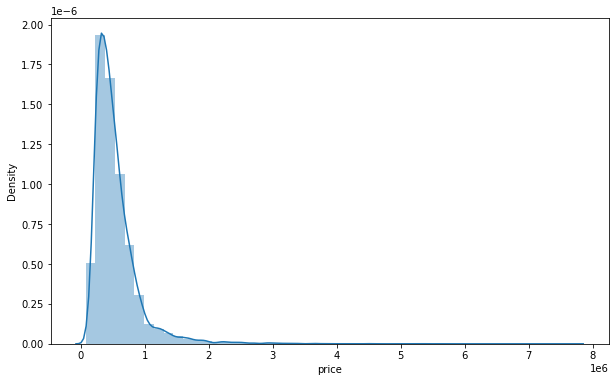
    


```python
plt.figure(figsize=(10,6))
sns.countplot(data['bedrooms'])
```

    C:\Users\sande\anaconda3\envs\tensorflow_learn\lib\site-packages\seaborn\_decorators.py:36: FutureWarning: Pass the following variable as a keyword arg: x. From version 0.12, the only valid positional argument will be `data`, and passing other arguments without an explicit keyword will result in an error or misinterpretation.
      warnings.warn(
    


    <AxesSubplot:xlabel='bedrooms', ylabel='count'>


    
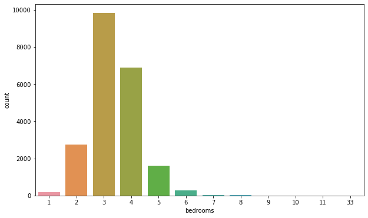
    


```python
# Analysis of Highly correlated features
data.corr()
```


<div>
<style scoped>
    .dataframe tbody tr th:only-of-type {
        vertical-align: middle;
    }

    .dataframe tbody tr th {
        vertical-align: top;
    }

    .dataframe thead th {
        text-align: right;
    }
</style>
<table border="1" class="dataframe">
  <thead>
    <tr style="text-align: right;">
      <th></th>
      <th>id</th>
      <th>price</th>
      <th>bedrooms</th>
      <th>bathrooms</th>
      <th>sqft_living</th>
      <th>sqft_lot</th>
      <th>floors</th>
      <th>waterfront</th>
      <th>view</th>
      <th>condition</th>
      <th>grade</th>
      <th>sqft_above</th>
      <th>sqft_basement</th>
      <th>yr_built</th>
      <th>yr_renovated</th>
      <th>zipcode</th>
      <th>lat</th>
      <th>long</th>
      <th>sqft_living15</th>
      <th>sqft_lot15</th>
    </tr>
  </thead>
  <tbody>
    <tr>
      <th>id</th>
      <td>1.000000</td>
      <td>-0.016772</td>
      <td>0.001150</td>
      <td>0.005162</td>
      <td>-0.012241</td>
      <td>-0.131911</td>
      <td>0.018608</td>
      <td>-0.002727</td>
      <td>0.011536</td>
      <td>-0.023803</td>
      <td>0.008188</td>
      <td>-0.010799</td>
      <td>-0.005193</td>
      <td>0.021617</td>
      <td>-0.016925</td>
      <td>-0.008211</td>
      <td>-0.001798</td>
      <td>0.020672</td>
      <td>-0.002701</td>
      <td>-0.138557</td>
    </tr>
    <tr>
      <th>price</th>
      <td>-0.016772</td>
      <td>1.000000</td>
      <td>0.308787</td>
      <td>0.525906</td>
      <td>0.701917</td>
      <td>0.089876</td>
      <td>0.256804</td>
      <td>0.266398</td>
      <td>0.397370</td>
      <td>0.036056</td>
      <td>0.667951</td>
      <td>0.605368</td>
      <td>0.323799</td>
      <td>0.053953</td>
      <td>0.126424</td>
      <td>-0.053402</td>
      <td>0.306692</td>
      <td>0.022036</td>
      <td>0.585241</td>
      <td>0.082845</td>
    </tr>
    <tr>
      <th>bedrooms</th>
      <td>0.001150</td>
      <td>0.308787</td>
      <td>1.000000</td>
      <td>0.514508</td>
      <td>0.578212</td>
      <td>0.032471</td>
      <td>0.177944</td>
      <td>-0.006834</td>
      <td>0.080008</td>
      <td>0.026496</td>
      <td>0.356563</td>
      <td>0.479386</td>
      <td>0.302808</td>
      <td>0.155670</td>
      <td>0.018389</td>
      <td>-0.154092</td>
      <td>-0.009951</td>
      <td>0.132054</td>
      <td>0.393406</td>
      <td>0.030690</td>
    </tr>
    <tr>
      <th>bathrooms</th>
      <td>0.005162</td>
      <td>0.525906</td>
      <td>0.514508</td>
      <td>1.000000</td>
      <td>0.755758</td>
      <td>0.088373</td>
      <td>0.502582</td>
      <td>0.063744</td>
      <td>0.188386</td>
      <td>-0.126479</td>
      <td>0.665838</td>
      <td>0.686668</td>
      <td>0.283440</td>
      <td>0.507173</td>
      <td>0.050544</td>
      <td>-0.204786</td>
      <td>0.024280</td>
      <td>0.224903</td>
      <td>0.569884</td>
      <td>0.088303</td>
    </tr>
    <tr>
      <th>sqft_living</th>
      <td>-0.012241</td>
      <td>0.701917</td>
      <td>0.578212</td>
      <td>0.755758</td>
      <td>1.000000</td>
      <td>0.173453</td>
      <td>0.353953</td>
      <td>0.103854</td>
      <td>0.284709</td>
      <td>-0.059445</td>
      <td>0.762779</td>
      <td>0.876448</td>
      <td>0.435130</td>
      <td>0.318152</td>
      <td>0.055308</td>
      <td>-0.199802</td>
      <td>0.052155</td>
      <td>0.241214</td>
      <td>0.756402</td>
      <td>0.184342</td>
    </tr>
    <tr>
      <th>sqft_lot</th>
      <td>-0.131911</td>
      <td>0.089876</td>
      <td>0.032471</td>
      <td>0.088373</td>
      <td>0.173453</td>
      <td>1.000000</td>
      <td>-0.004814</td>
      <td>0.021632</td>
      <td>0.074900</td>
      <td>-0.008830</td>
      <td>0.114731</td>
      <td>0.184139</td>
      <td>0.015418</td>
      <td>0.052946</td>
      <td>0.007686</td>
      <td>-0.129586</td>
      <td>-0.085514</td>
      <td>0.230227</td>
      <td>0.144763</td>
      <td>0.718204</td>
    </tr>
    <tr>
      <th>floors</th>
      <td>0.018608</td>
      <td>0.256804</td>
      <td>0.177944</td>
      <td>0.502582</td>
      <td>0.353953</td>
      <td>-0.004814</td>
      <td>1.000000</td>
      <td>0.023755</td>
      <td>0.028814</td>
      <td>-0.264075</td>
      <td>0.458794</td>
      <td>0.523989</td>
      <td>-0.245715</td>
      <td>0.489193</td>
      <td>0.006427</td>
      <td>-0.059541</td>
      <td>0.049239</td>
      <td>0.125943</td>
      <td>0.280102</td>
      <td>-0.010722</td>
    </tr>
    <tr>
      <th>waterfront</th>
      <td>-0.002727</td>
      <td>0.266398</td>
      <td>-0.006834</td>
      <td>0.063744</td>
      <td>0.103854</td>
      <td>0.021632</td>
      <td>0.023755</td>
      <td>1.000000</td>
      <td>0.401971</td>
      <td>0.016611</td>
      <td>0.082888</td>
      <td>0.072109</td>
      <td>0.080559</td>
      <td>-0.026153</td>
      <td>0.092873</td>
      <td>0.030272</td>
      <td>-0.014306</td>
      <td>-0.041904</td>
      <td>0.086507</td>
      <td>0.030781</td>
    </tr>
    <tr>
      <th>view</th>
      <td>0.011536</td>
      <td>0.397370</td>
      <td>0.080008</td>
      <td>0.188386</td>
      <td>0.284709</td>
      <td>0.074900</td>
      <td>0.028814</td>
      <td>0.401971</td>
      <td>1.000000</td>
      <td>0.045999</td>
      <td>0.251728</td>
      <td>0.167609</td>
      <td>0.277078</td>
      <td>-0.053636</td>
      <td>0.103951</td>
      <td>0.084622</td>
      <td>0.005871</td>
      <td>-0.078107</td>
      <td>0.280681</td>
      <td>0.072904</td>
    </tr>
    <tr>
      <th>condition</th>
      <td>-0.023803</td>
      <td>0.036056</td>
      <td>0.026496</td>
      <td>-0.126479</td>
      <td>-0.059445</td>
      <td>-0.008830</td>
      <td>-0.264075</td>
      <td>0.016611</td>
      <td>0.045999</td>
      <td>1.000000</td>
      <td>-0.146896</td>
      <td>-0.158904</td>
      <td>0.173849</td>
      <td>-0.361592</td>
      <td>-0.060788</td>
      <td>0.002888</td>
      <td>-0.015102</td>
      <td>-0.105877</td>
      <td>-0.093072</td>
      <td>-0.003126</td>
    </tr>
    <tr>
      <th>grade</th>
      <td>0.008188</td>
      <td>0.667951</td>
      <td>0.356563</td>
      <td>0.665838</td>
      <td>0.762779</td>
      <td>0.114731</td>
      <td>0.458794</td>
      <td>0.082888</td>
      <td>0.251728</td>
      <td>-0.146896</td>
      <td>1.000000</td>
      <td>0.756073</td>
      <td>0.168220</td>
      <td>0.447865</td>
      <td>0.014261</td>
      <td>-0.185771</td>
      <td>0.113575</td>
      <td>0.200341</td>
      <td>0.713867</td>
      <td>0.120981</td>
    </tr>
    <tr>
      <th>sqft_above</th>
      <td>-0.010799</td>
      <td>0.605368</td>
      <td>0.479386</td>
      <td>0.686668</td>
      <td>0.876448</td>
      <td>0.184139</td>
      <td>0.523989</td>
      <td>0.072109</td>
      <td>0.167609</td>
      <td>-0.158904</td>
      <td>0.756073</td>
      <td>1.000000</td>
      <td>-0.052156</td>
      <td>0.424037</td>
      <td>0.023251</td>
      <td>-0.261570</td>
      <td>-0.001199</td>
      <td>0.344842</td>
      <td>0.731767</td>
      <td>0.195077</td>
    </tr>
    <tr>
      <th>sqft_basement</th>
      <td>-0.005193</td>
      <td>0.323799</td>
      <td>0.302808</td>
      <td>0.283440</td>
      <td>0.435130</td>
      <td>0.015418</td>
      <td>-0.245715</td>
      <td>0.080559</td>
      <td>0.277078</td>
      <td>0.173849</td>
      <td>0.168220</td>
      <td>-0.052156</td>
      <td>1.000000</td>
      <td>-0.133064</td>
      <td>0.071233</td>
      <td>0.074725</td>
      <td>0.110414</td>
      <td>-0.144546</td>
      <td>0.200443</td>
      <td>0.017550</td>
    </tr>
    <tr>
      <th>yr_built</th>
      <td>0.021617</td>
      <td>0.053953</td>
      <td>0.155670</td>
      <td>0.507173</td>
      <td>0.318152</td>
      <td>0.052946</td>
      <td>0.489193</td>
      <td>-0.026153</td>
      <td>-0.053636</td>
      <td>-0.361592</td>
      <td>0.447865</td>
      <td>0.424037</td>
      <td>-0.133064</td>
      <td>1.000000</td>
      <td>-0.224907</td>
      <td>-0.347210</td>
      <td>-0.148370</td>
      <td>0.409993</td>
      <td>0.326377</td>
      <td>0.070777</td>
    </tr>
    <tr>
      <th>yr_renovated</th>
      <td>-0.016925</td>
      <td>0.126424</td>
      <td>0.018389</td>
      <td>0.050544</td>
      <td>0.055308</td>
      <td>0.007686</td>
      <td>0.006427</td>
      <td>0.092873</td>
      <td>0.103951</td>
      <td>-0.060788</td>
      <td>0.014261</td>
      <td>0.023251</td>
      <td>0.071233</td>
      <td>-0.224907</td>
      <td>1.000000</td>
      <td>0.064325</td>
      <td>0.029350</td>
      <td>-0.068321</td>
      <td>-0.002695</td>
      <td>0.007944</td>
    </tr>
    <tr>
      <th>zipcode</th>
      <td>-0.008211</td>
      <td>-0.053402</td>
      <td>-0.154092</td>
      <td>-0.204786</td>
      <td>-0.199802</td>
      <td>-0.129586</td>
      <td>-0.059541</td>
      <td>0.030272</td>
      <td>0.084622</td>
      <td>0.002888</td>
      <td>-0.185771</td>
      <td>-0.261570</td>
      <td>0.074725</td>
      <td>-0.347210</td>
      <td>0.064325</td>
      <td>1.000000</td>
      <td>0.266742</td>
      <td>-0.564259</td>
      <td>-0.279299</td>
      <td>-0.147294</td>
    </tr>
    <tr>
      <th>lat</th>
      <td>-0.001798</td>
      <td>0.306692</td>
      <td>-0.009951</td>
      <td>0.024280</td>
      <td>0.052155</td>
      <td>-0.085514</td>
      <td>0.049239</td>
      <td>-0.014306</td>
      <td>0.005871</td>
      <td>-0.015102</td>
      <td>0.113575</td>
      <td>-0.001199</td>
      <td>0.110414</td>
      <td>-0.148370</td>
      <td>0.029350</td>
      <td>0.266742</td>
      <td>1.000000</td>
      <td>-0.135371</td>
      <td>0.048679</td>
      <td>-0.086139</td>
    </tr>
    <tr>
      <th>long</th>
      <td>0.020672</td>
      <td>0.022036</td>
      <td>0.132054</td>
      <td>0.224903</td>
      <td>0.241214</td>
      <td>0.230227</td>
      <td>0.125943</td>
      <td>-0.041904</td>
      <td>-0.078107</td>
      <td>-0.105877</td>
      <td>0.200341</td>
      <td>0.344842</td>
      <td>-0.144546</td>
      <td>0.409993</td>
      <td>-0.068321</td>
      <td>-0.564259</td>
      <td>-0.135371</td>
      <td>1.000000</td>
      <td>0.335626</td>
      <td>0.255586</td>
    </tr>
    <tr>
      <th>sqft_living15</th>
      <td>-0.002701</td>
      <td>0.585241</td>
      <td>0.393406</td>
      <td>0.569884</td>
      <td>0.756402</td>
      <td>0.144763</td>
      <td>0.280102</td>
      <td>0.086507</td>
      <td>0.280681</td>
      <td>-0.093072</td>
      <td>0.713867</td>
      <td>0.731767</td>
      <td>0.200443</td>
      <td>0.326377</td>
      <td>-0.002695</td>
      <td>-0.279299</td>
      <td>0.048679</td>
      <td>0.335626</td>
      <td>1.000000</td>
      <td>0.183515</td>
    </tr>
    <tr>
      <th>sqft_lot15</th>
      <td>-0.138557</td>
      <td>0.082845</td>
      <td>0.030690</td>
      <td>0.088303</td>
      <td>0.184342</td>
      <td>0.718204</td>
      <td>-0.010722</td>
      <td>0.030781</td>
      <td>0.072904</td>
      <td>-0.003126</td>
      <td>0.120981</td>
      <td>0.195077</td>
      <td>0.017550</td>
      <td>0.070777</td>
      <td>0.007944</td>
      <td>-0.147294</td>
      <td>-0.086139</td>
      <td>0.255586</td>
      <td>0.183515</td>
      <td>1.000000</td>
    </tr>
  </tbody>
</table>
</div>


```python
# correlation for price
data.corr()['price'].sort_values()
# from o/p the price is 1 and it is highly correlated with field sqt_living etc.
```


    zipcode         -0.053402
    id              -0.016772
    long             0.022036
    condition        0.036056
    yr_built         0.053953
    sqft_lot15       0.082845
    sqft_lot         0.089876
    yr_renovated     0.126424
    floors           0.256804
    waterfront       0.266398
    lat              0.306692
    bedrooms         0.308787
    sqft_basement    0.323799
    view             0.397370
    bathrooms        0.525906
    sqft_living15    0.585241
    sqft_above       0.605368
    grade            0.667951
    sqft_living      0.701917
    price            1.000000
    Name: price, dtype: float64


```python
# check correlation using scatter plot
plt.figure(figsize=(10,5))
sns.scatterplot(x='price', y='sqft_living', data=data)
```


    <AxesSubplot:xlabel='price', ylabel='sqft_living'>


    
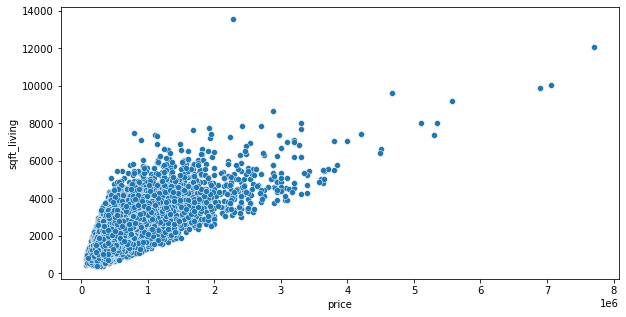
    


```python
#plt.figure(figsize=(10,5))
#sns.boxplot(x='price', y='sqft_living', data=data)
```


```python
data.columns
```


    Index(['id', 'date', 'price', 'bedrooms', 'bathrooms', 'sqft_living',
           'sqft_lot', 'floors', 'waterfront', 'view', 'condition', 'grade',
           'sqft_above', 'sqft_basement', 'yr_built', 'yr_renovated', 'zipcode',
           'lat', 'long', 'sqft_living15', 'sqft_lot15'],
          dtype='object')


```python
# check how the price is related with location
plt.figure(figsize=(10,5))
sns.scatterplot(x='price', y='long', data=data)
```


    <AxesSubplot:xlabel='price', ylabel='long'>


    
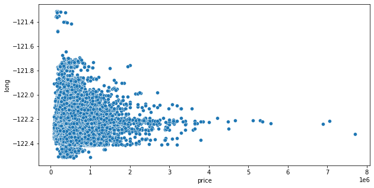
    


```python
# Plot long vs lat
plt.figure(figsize=(10,5))
sns.scatterplot(x='long', y='lat', data=data)
```


    <AxesSubplot:xlabel='long', ylabel='lat'>


    
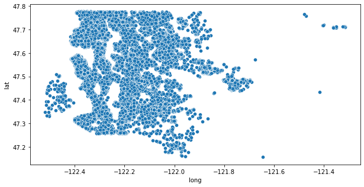
    


```python
# Plot long vs lat with price
plt.figure(figsize=(10,5))
sns.scatterplot(x='long', y='lat', data=data, hue='price')
```


    <AxesSubplot:xlabel='long', ylabel='lat'>


    
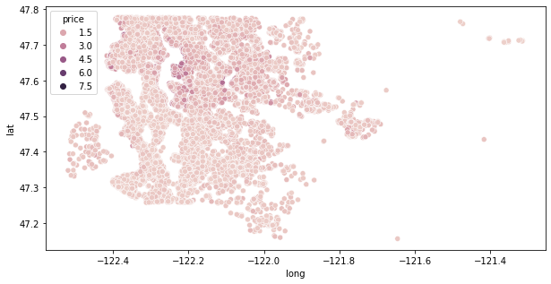
    


```python
# Retrive the costliest house 
data.sort_values('price', ascending=False).head(20)
```


<div>
<style scoped>
    .dataframe tbody tr th:only-of-type {
        vertical-align: middle;
    }

    .dataframe tbody tr th {
        vertical-align: top;
    }

    .dataframe thead th {
        text-align: right;
    }
</style>
<table border="1" class="dataframe">
  <thead>
    <tr style="text-align: right;">
      <th></th>
      <th>id</th>
      <th>date</th>
      <th>price</th>
      <th>bedrooms</th>
      <th>bathrooms</th>
      <th>sqft_living</th>
      <th>sqft_lot</th>
      <th>floors</th>
      <th>waterfront</th>
      <th>view</th>
      <th>...</th>
      <th>grade</th>
      <th>sqft_above</th>
      <th>sqft_basement</th>
      <th>yr_built</th>
      <th>yr_renovated</th>
      <th>zipcode</th>
      <th>lat</th>
      <th>long</th>
      <th>sqft_living15</th>
      <th>sqft_lot15</th>
    </tr>
  </thead>
  <tbody>
    <tr>
      <th>7245</th>
      <td>6762700020</td>
      <td>10/13/2014</td>
      <td>7700000.0</td>
      <td>6</td>
      <td>8.00</td>
      <td>12050</td>
      <td>27600</td>
      <td>2.5</td>
      <td>0</td>
      <td>3</td>
      <td>...</td>
      <td>13</td>
      <td>8570</td>
      <td>3480</td>
      <td>1910</td>
      <td>1987</td>
      <td>98102</td>
      <td>47.6298</td>
      <td>-122.323</td>
      <td>3940</td>
      <td>8800</td>
    </tr>
    <tr>
      <th>3910</th>
      <td>9808700762</td>
      <td>6/11/2014</td>
      <td>7060000.0</td>
      <td>5</td>
      <td>4.50</td>
      <td>10040</td>
      <td>37325</td>
      <td>2.0</td>
      <td>1</td>
      <td>2</td>
      <td>...</td>
      <td>11</td>
      <td>7680</td>
      <td>2360</td>
      <td>1940</td>
      <td>2001</td>
      <td>98004</td>
      <td>47.6500</td>
      <td>-122.214</td>
      <td>3930</td>
      <td>25449</td>
    </tr>
    <tr>
      <th>9245</th>
      <td>9208900037</td>
      <td>9/19/2014</td>
      <td>6890000.0</td>
      <td>6</td>
      <td>7.75</td>
      <td>9890</td>
      <td>31374</td>
      <td>2.0</td>
      <td>0</td>
      <td>4</td>
      <td>...</td>
      <td>13</td>
      <td>8860</td>
      <td>1030</td>
      <td>2001</td>
      <td>0</td>
      <td>98039</td>
      <td>47.6305</td>
      <td>-122.240</td>
      <td>4540</td>
      <td>42730</td>
    </tr>
    <tr>
      <th>4407</th>
      <td>2470100110</td>
      <td>8/4/2014</td>
      <td>5570000.0</td>
      <td>5</td>
      <td>5.75</td>
      <td>9200</td>
      <td>35069</td>
      <td>2.0</td>
      <td>0</td>
      <td>0</td>
      <td>...</td>
      <td>13</td>
      <td>6200</td>
      <td>3000</td>
      <td>2001</td>
      <td>0</td>
      <td>98039</td>
      <td>47.6289</td>
      <td>-122.233</td>
      <td>3560</td>
      <td>24345</td>
    </tr>
    <tr>
      <th>1446</th>
      <td>8907500070</td>
      <td>4/13/2015</td>
      <td>5350000.0</td>
      <td>5</td>
      <td>5.00</td>
      <td>8000</td>
      <td>23985</td>
      <td>2.0</td>
      <td>0</td>
      <td>4</td>
      <td>...</td>
      <td>12</td>
      <td>6720</td>
      <td>1280</td>
      <td>2009</td>
      <td>0</td>
      <td>98004</td>
      <td>47.6232</td>
      <td>-122.220</td>
      <td>4600</td>
      <td>21750</td>
    </tr>
    <tr>
      <th>1313</th>
      <td>7558700030</td>
      <td>4/13/2015</td>
      <td>5300000.0</td>
      <td>6</td>
      <td>6.00</td>
      <td>7390</td>
      <td>24829</td>
      <td>2.0</td>
      <td>1</td>
      <td>4</td>
      <td>...</td>
      <td>12</td>
      <td>5000</td>
      <td>2390</td>
      <td>1991</td>
      <td>0</td>
      <td>98040</td>
      <td>47.5631</td>
      <td>-122.210</td>
      <td>4320</td>
      <td>24619</td>
    </tr>
    <tr>
      <th>1162</th>
      <td>1247600105</td>
      <td>10/20/2014</td>
      <td>5110000.0</td>
      <td>5</td>
      <td>5.25</td>
      <td>8010</td>
      <td>45517</td>
      <td>2.0</td>
      <td>1</td>
      <td>4</td>
      <td>...</td>
      <td>12</td>
      <td>5990</td>
      <td>2020</td>
      <td>1999</td>
      <td>0</td>
      <td>98033</td>
      <td>47.6767</td>
      <td>-122.211</td>
      <td>3430</td>
      <td>26788</td>
    </tr>
    <tr>
      <th>8085</th>
      <td>1924059029</td>
      <td>6/17/2014</td>
      <td>4670000.0</td>
      <td>5</td>
      <td>6.75</td>
      <td>9640</td>
      <td>13068</td>
      <td>1.0</td>
      <td>1</td>
      <td>4</td>
      <td>...</td>
      <td>12</td>
      <td>4820</td>
      <td>4820</td>
      <td>1983</td>
      <td>2009</td>
      <td>98040</td>
      <td>47.5570</td>
      <td>-122.210</td>
      <td>3270</td>
      <td>10454</td>
    </tr>
    <tr>
      <th>2624</th>
      <td>7738500731</td>
      <td>8/15/2014</td>
      <td>4500000.0</td>
      <td>5</td>
      <td>5.50</td>
      <td>6640</td>
      <td>40014</td>
      <td>2.0</td>
      <td>1</td>
      <td>4</td>
      <td>...</td>
      <td>12</td>
      <td>6350</td>
      <td>290</td>
      <td>2004</td>
      <td>0</td>
      <td>98155</td>
      <td>47.7493</td>
      <td>-122.280</td>
      <td>3030</td>
      <td>23408</td>
    </tr>
    <tr>
      <th>8629</th>
      <td>3835500195</td>
      <td>6/18/2014</td>
      <td>4490000.0</td>
      <td>4</td>
      <td>3.00</td>
      <td>6430</td>
      <td>27517</td>
      <td>2.0</td>
      <td>0</td>
      <td>0</td>
      <td>...</td>
      <td>12</td>
      <td>6430</td>
      <td>0</td>
      <td>2001</td>
      <td>0</td>
      <td>98004</td>
      <td>47.6208</td>
      <td>-122.219</td>
      <td>3720</td>
      <td>14592</td>
    </tr>
    <tr>
      <th>12358</th>
      <td>6065300370</td>
      <td>5/6/2015</td>
      <td>4210000.0</td>
      <td>5</td>
      <td>6.00</td>
      <td>7440</td>
      <td>21540</td>
      <td>2.0</td>
      <td>0</td>
      <td>0</td>
      <td>...</td>
      <td>12</td>
      <td>5550</td>
      <td>1890</td>
      <td>2003</td>
      <td>0</td>
      <td>98006</td>
      <td>47.5692</td>
      <td>-122.189</td>
      <td>4740</td>
      <td>19329</td>
    </tr>
    <tr>
      <th>4145</th>
      <td>6447300265</td>
      <td>10/14/2014</td>
      <td>4000000.0</td>
      <td>4</td>
      <td>5.50</td>
      <td>7080</td>
      <td>16573</td>
      <td>2.0</td>
      <td>0</td>
      <td>0</td>
      <td>...</td>
      <td>12</td>
      <td>5760</td>
      <td>1320</td>
      <td>2008</td>
      <td>0</td>
      <td>98039</td>
      <td>47.6151</td>
      <td>-122.224</td>
      <td>3140</td>
      <td>15996</td>
    </tr>
    <tr>
      <th>2083</th>
      <td>8106100105</td>
      <td>11/14/2014</td>
      <td>3850000.0</td>
      <td>4</td>
      <td>4.25</td>
      <td>5770</td>
      <td>21300</td>
      <td>2.0</td>
      <td>1</td>
      <td>4</td>
      <td>...</td>
      <td>11</td>
      <td>5770</td>
      <td>0</td>
      <td>1980</td>
      <td>0</td>
      <td>98040</td>
      <td>47.5850</td>
      <td>-122.222</td>
      <td>4620</td>
      <td>22748</td>
    </tr>
    <tr>
      <th>7028</th>
      <td>853200010</td>
      <td>7/1/2014</td>
      <td>3800000.0</td>
      <td>5</td>
      <td>5.50</td>
      <td>7050</td>
      <td>42840</td>
      <td>1.0</td>
      <td>0</td>
      <td>2</td>
      <td>...</td>
      <td>13</td>
      <td>4320</td>
      <td>2730</td>
      <td>1978</td>
      <td>0</td>
      <td>98004</td>
      <td>47.6229</td>
      <td>-122.220</td>
      <td>5070</td>
      <td>20570</td>
    </tr>
    <tr>
      <th>19002</th>
      <td>2303900100</td>
      <td>9/11/2014</td>
      <td>3800000.0</td>
      <td>3</td>
      <td>4.25</td>
      <td>5510</td>
      <td>35000</td>
      <td>2.0</td>
      <td>0</td>
      <td>4</td>
      <td>...</td>
      <td>13</td>
      <td>4910</td>
      <td>600</td>
      <td>1997</td>
      <td>0</td>
      <td>98177</td>
      <td>47.7296</td>
      <td>-122.370</td>
      <td>3430</td>
      <td>45302</td>
    </tr>
    <tr>
      <th>16288</th>
      <td>7397300170</td>
      <td>5/30/2014</td>
      <td>3710000.0</td>
      <td>4</td>
      <td>3.50</td>
      <td>5550</td>
      <td>28078</td>
      <td>2.0</td>
      <td>0</td>
      <td>2</td>
      <td>...</td>
      <td>12</td>
      <td>3350</td>
      <td>2200</td>
      <td>2000</td>
      <td>0</td>
      <td>98039</td>
      <td>47.6395</td>
      <td>-122.234</td>
      <td>2980</td>
      <td>19602</td>
    </tr>
    <tr>
      <th>18467</th>
      <td>4389201095</td>
      <td>5/11/2015</td>
      <td>3650000.0</td>
      <td>5</td>
      <td>3.75</td>
      <td>5020</td>
      <td>8694</td>
      <td>2.0</td>
      <td>0</td>
      <td>1</td>
      <td>...</td>
      <td>12</td>
      <td>3970</td>
      <td>1050</td>
      <td>2007</td>
      <td>0</td>
      <td>98004</td>
      <td>47.6146</td>
      <td>-122.213</td>
      <td>4190</td>
      <td>11275</td>
    </tr>
    <tr>
      <th>6502</th>
      <td>4217402115</td>
      <td>4/21/2015</td>
      <td>3650000.0</td>
      <td>6</td>
      <td>4.75</td>
      <td>5480</td>
      <td>19401</td>
      <td>1.5</td>
      <td>1</td>
      <td>4</td>
      <td>...</td>
      <td>11</td>
      <td>3910</td>
      <td>1570</td>
      <td>1936</td>
      <td>0</td>
      <td>98105</td>
      <td>47.6515</td>
      <td>-122.277</td>
      <td>3510</td>
      <td>15810</td>
    </tr>
    <tr>
      <th>15241</th>
      <td>2425049063</td>
      <td>9/11/2014</td>
      <td>3640000.0</td>
      <td>4</td>
      <td>3.25</td>
      <td>4830</td>
      <td>22257</td>
      <td>2.0</td>
      <td>1</td>
      <td>4</td>
      <td>...</td>
      <td>11</td>
      <td>4830</td>
      <td>0</td>
      <td>1990</td>
      <td>0</td>
      <td>98039</td>
      <td>47.6409</td>
      <td>-122.241</td>
      <td>3820</td>
      <td>25582</td>
    </tr>
    <tr>
      <th>19133</th>
      <td>3625049042</td>
      <td>10/11/2014</td>
      <td>3640000.0</td>
      <td>5</td>
      <td>6.00</td>
      <td>5490</td>
      <td>19897</td>
      <td>2.0</td>
      <td>0</td>
      <td>0</td>
      <td>...</td>
      <td>12</td>
      <td>5490</td>
      <td>0</td>
      <td>2005</td>
      <td>0</td>
      <td>98039</td>
      <td>47.6165</td>
      <td>-122.236</td>
      <td>2910</td>
      <td>17600</td>
    </tr>
  </tbody>
</table>
<p>20 rows × 21 columns</p>
</div>


```python
# remove top 1% of houses
len(data) * 0.01
```


    215.97


```python
bottom_90_percent = data.sort_values('price', ascending=False).iloc[216:]
```


```python
# Plot long vs lat with price
plt.figure(figsize=(12,8))
sns.scatterplot(x='long', y='lat', data=bottom_90_percent, 
                edgecolor=None,
                alpha=0.2,
                palette='RdYlGn',
                hue='price')
```


    <AxesSubplot:xlabel='long', ylabel='lat'>


    
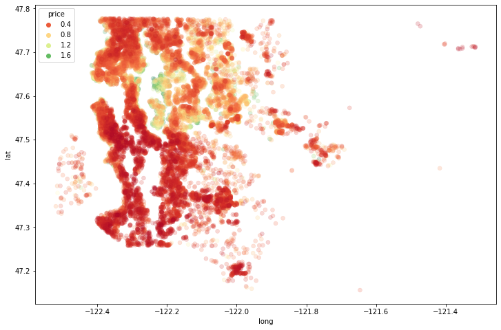
    


# Part 2 - Feature Engineering


```python
# Drop id col
data = data.drop('id', axis=1)
```


```python
data['date']
```


    0        10/13/2014
    1         12/9/2014
    2         2/25/2015
    3         12/9/2014
    4         2/18/2015
                ...    
    21592     5/21/2014
    21593     2/23/2015
    21594     6/23/2014
    21595     1/16/2015
    21596    10/15/2014
    Name: date, Length: 21597, dtype: object


```python
# convert string to datetime
data['date'] = pd.to_datetime(data['date'])
```


```python
data['date']
```


    0       2014-10-13
    1       2014-12-09
    2       2015-02-25
    3       2014-12-09
    4       2015-02-18
               ...    
    21592   2014-05-21
    21593   2015-02-23
    21594   2014-06-23
    21595   2015-01-16
    21596   2014-10-15
    Name: date, Length: 21597, dtype: datetime64[ns]


```python
# Extract year from date
def extract_year(date):
    return date.year

# OR

# Use lambda
```


```python
data['year'] = data['date'].apply(lambda date: date.year)
data['month'] = data['date'].apply(lambda date: date.month) 
```


```python
data.head()
```


<div>
<style scoped>
    .dataframe tbody tr th:only-of-type {
        vertical-align: middle;
    }

    .dataframe tbody tr th {
        vertical-align: top;
    }

    .dataframe thead th {
        text-align: right;
    }
</style>
<table border="1" class="dataframe">
  <thead>
    <tr style="text-align: right;">
      <th></th>
      <th>date</th>
      <th>price</th>
      <th>bedrooms</th>
      <th>bathrooms</th>
      <th>sqft_living</th>
      <th>sqft_lot</th>
      <th>floors</th>
      <th>waterfront</th>
      <th>view</th>
      <th>condition</th>
      <th>...</th>
      <th>sqft_basement</th>
      <th>yr_built</th>
      <th>yr_renovated</th>
      <th>zipcode</th>
      <th>lat</th>
      <th>long</th>
      <th>sqft_living15</th>
      <th>sqft_lot15</th>
      <th>year</th>
      <th>month</th>
    </tr>
  </thead>
  <tbody>
    <tr>
      <th>0</th>
      <td>2014-10-13</td>
      <td>221900.0</td>
      <td>3</td>
      <td>1.00</td>
      <td>1180</td>
      <td>5650</td>
      <td>1.0</td>
      <td>0</td>
      <td>0</td>
      <td>3</td>
      <td>...</td>
      <td>0</td>
      <td>1955</td>
      <td>0</td>
      <td>98178</td>
      <td>47.5112</td>
      <td>-122.257</td>
      <td>1340</td>
      <td>5650</td>
      <td>2014</td>
      <td>10</td>
    </tr>
    <tr>
      <th>1</th>
      <td>2014-12-09</td>
      <td>538000.0</td>
      <td>3</td>
      <td>2.25</td>
      <td>2570</td>
      <td>7242</td>
      <td>2.0</td>
      <td>0</td>
      <td>0</td>
      <td>3</td>
      <td>...</td>
      <td>400</td>
      <td>1951</td>
      <td>1991</td>
      <td>98125</td>
      <td>47.7210</td>
      <td>-122.319</td>
      <td>1690</td>
      <td>7639</td>
      <td>2014</td>
      <td>12</td>
    </tr>
    <tr>
      <th>2</th>
      <td>2015-02-25</td>
      <td>180000.0</td>
      <td>2</td>
      <td>1.00</td>
      <td>770</td>
      <td>10000</td>
      <td>1.0</td>
      <td>0</td>
      <td>0</td>
      <td>3</td>
      <td>...</td>
      <td>0</td>
      <td>1933</td>
      <td>0</td>
      <td>98028</td>
      <td>47.7379</td>
      <td>-122.233</td>
      <td>2720</td>
      <td>8062</td>
      <td>2015</td>
      <td>2</td>
    </tr>
    <tr>
      <th>3</th>
      <td>2014-12-09</td>
      <td>604000.0</td>
      <td>4</td>
      <td>3.00</td>
      <td>1960</td>
      <td>5000</td>
      <td>1.0</td>
      <td>0</td>
      <td>0</td>
      <td>5</td>
      <td>...</td>
      <td>910</td>
      <td>1965</td>
      <td>0</td>
      <td>98136</td>
      <td>47.5208</td>
      <td>-122.393</td>
      <td>1360</td>
      <td>5000</td>
      <td>2014</td>
      <td>12</td>
    </tr>
    <tr>
      <th>4</th>
      <td>2015-02-18</td>
      <td>510000.0</td>
      <td>3</td>
      <td>2.00</td>
      <td>1680</td>
      <td>8080</td>
      <td>1.0</td>
      <td>0</td>
      <td>0</td>
      <td>3</td>
      <td>...</td>
      <td>0</td>
      <td>1987</td>
      <td>0</td>
      <td>98074</td>
      <td>47.6168</td>
      <td>-122.045</td>
      <td>1800</td>
      <td>7503</td>
      <td>2015</td>
      <td>2</td>
    </tr>
  </tbody>
</table>
<p>5 rows × 22 columns</p>
</div>


```python
# Based on month, what was the price
data.groupby('month').mean()['price']
```


    month
    1     525963.251534
    2     508520.051323
    3     544057.683200
    4     562215.615074
    5     550849.746893
    6     557534.318182
    7     544892.161013
    8     536655.212481
    9     529723.517787
    10    539439.447228
    11    522359.903478
    12    524799.902041
    Name: price, dtype: float64


```python
# Based on month, what was the price - plot
data.groupby('month').mean()['price'].plot()
```


    <AxesSubplot:xlabel='month'>


    
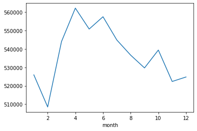
    


```python
# Based on year, what was the price - plot
data.groupby('year').mean()['price'].plot()
```


    <AxesSubplot:xlabel='year'>


    
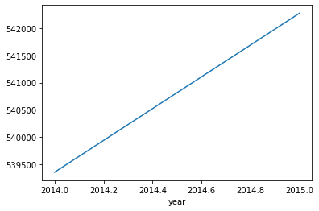
    


```python
# Drop date col
data = data.drop('date', axis=1)
```


```python
data.columns
```


    Index(['price', 'bedrooms', 'bathrooms', 'sqft_living', 'sqft_lot', 'floors',
           'waterfront', 'view', 'condition', 'grade', 'sqft_above',
           'sqft_basement', 'yr_built', 'yr_renovated', 'zipcode', 'lat', 'long',
           'sqft_living15', 'sqft_lot15', 'year', 'month'],
          dtype='object')


```python
# Get unique zip codes
data['zipcode'].value_counts()
```


    98103    602
    98038    589
    98115    583
    98052    574
    98117    553
            ... 
    98102    104
    98010    100
    98024     80
    98148     57
    98039     50
    Name: zipcode, Length: 70, dtype: int64


```python
# We cannot categorized zipcode bez it has 70 unique length.
# We can find a person who has domain knowlege of zip codes. And for us they can categorize the zip codes based 
# on different directions N,E,W,S.
```


```python
# for now, we are drooping zipcode
data = data.drop('zipcode', axis=1)
```


```python
# check for yr_renovated cols
data['yr_renovated'].value_counts()
```


    0       20683
    2014       91
    2013       37
    2003       36
    2007       35
            ...  
    1948        1
    1954        1
    1951        1
    1944        1
    1959        1
    Name: yr_renovated, Length: 70, dtype: int64


# STEP-02-Data Preprocessing, Creating a Model


```python
X = data.drop('price', axis=1).values # returns numpy array
y = data['price'].values
```


```python
# data spliting
from sklearn.model_selection import train_test_split
```


```python
X_train, X_test, y_train, y_test = train_test_split(X, y, test_size=0.3, random_state=101)
```


```python
# Scaling
from sklearn.preprocessing import MinMaxScaler
```


```python
scaler = MinMaxScaler()
```


```python
X_train = scaler.fit_transform(X_train)
X_test = scaler.transform(X_test)
```


```python
# Create Model
from tensorflow.keras.models import Sequential
from tensorflow.keras.layers import Dense
```


```python
model = Sequential()

model.add(Dense(19, activation='relu'))
model.add(Dense(19, activation='relu'))
model.add(Dense(19, activation='relu'))
model.add(Dense(19, activation='relu'))

model.add(Dense(1))

model.compile(optimizer='adam', loss='mse')
```


```python
# Validation data checks on every epoch, the loss is calculated.
# Batch size in powers of 2, for big data. The smaller batch size longer duration. But solves overfitting problem.
model.fit(x=X_train, y=y_train, validation_data=(X_test, y_test), batch_size=128, epochs=400, verbose=0)
```


```python
# Get history of losses
pd.DataFrame(model.history.history)

# We get two values.
# loss-> on training and  val_loss -> on test.
# we can check by comparing both, is our model overfitting or not. 
```


<div>
<style scoped>
    .dataframe tbody tr th:only-of-type {
        vertical-align: middle;
    }

    .dataframe tbody tr th {
        vertical-align: top;
    }

    .dataframe thead th {
        text-align: right;
    }
</style>
<table border="1" class="dataframe">
  <thead>
    <tr style="text-align: right;">
      <th></th>
      <th>loss</th>
      <th>val_loss</th>
    </tr>
  </thead>
  <tbody>
    <tr>
      <th>0</th>
      <td>4.302350e+11</td>
      <td>4.188849e+11</td>
    </tr>
    <tr>
      <th>1</th>
      <td>4.288104e+11</td>
      <td>4.140352e+11</td>
    </tr>
    <tr>
      <th>2</th>
      <td>4.101760e+11</td>
      <td>3.721530e+11</td>
    </tr>
    <tr>
      <th>3</th>
      <td>3.231278e+11</td>
      <td>2.361804e+11</td>
    </tr>
    <tr>
      <th>4</th>
      <td>1.678761e+11</td>
      <td>1.075330e+11</td>
    </tr>
    <tr>
      <th>...</th>
      <td>...</td>
      <td>...</td>
    </tr>
    <tr>
      <th>395</th>
      <td>2.923890e+10</td>
      <td>2.704199e+10</td>
    </tr>
    <tr>
      <th>396</th>
      <td>2.924328e+10</td>
      <td>2.694228e+10</td>
    </tr>
    <tr>
      <th>397</th>
      <td>2.921650e+10</td>
      <td>2.694989e+10</td>
    </tr>
    <tr>
      <th>398</th>
      <td>2.922421e+10</td>
      <td>2.693923e+10</td>
    </tr>
    <tr>
      <th>399</th>
      <td>2.922209e+10</td>
      <td>2.694393e+10</td>
    </tr>
  </tbody>
</table>
<p>400 rows × 2 columns</p>
</div>


```python
# to check model is overfiting or not plot it
# if the val_loss is increases at the end, that means we are overfiting to training data.
losses = pd.DataFrame(model.history.history)
losses.plot()
```


    <AxesSubplot:>


    
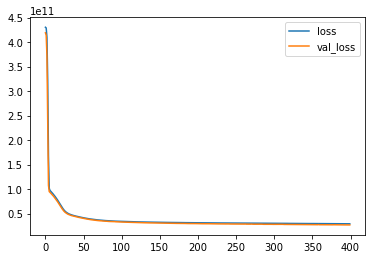
    


# Step-03: Evaluation


```python
from sklearn.metrics import mean_absolute_error, mean_squared_error, explained_variance_score
```


```python
# predict on test set
predictions = model.predict(X_test)
```


```python
# evaluate predictions
# pass y true and predictions
mean_squared_error(y_test, predictions)
# large value get another method
```


    26943932763.498466


```python
mean_absolute_error(y_test, predictions)
# it means we are off by dollar 100594.
# to compare get mean of the data
```


    100594.14832175926


```python
data['price'].describe()
# we are off by huge percentage.
```


    count    2.159700e+04
    mean     5.402966e+05
    std      3.673681e+05
    min      7.800000e+04
    25%      3.220000e+05
    50%      4.500000e+05
    75%      6.450000e+05
    max      7.700000e+06
    Name: price, dtype: float64


```python
plt.figure(figsize=(12,6))
plt.scatter(y_test, predictions)
plt.plot(y_test, y_test, 'red')
```


    [<matplotlib.lines.Line2D at 0x1500dd6b190>]


    
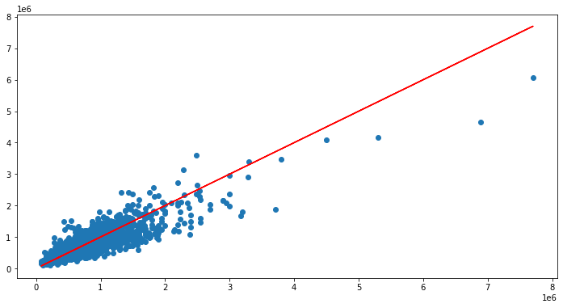
    


```python
explained_variance_score(y_test, predictions)
# we can predict accuractely for low prices houses. see above chart
```


    0.7968846898551887


```python
# Prediction for single data
single_house = data.drop('price', axis=1).iloc[0]
```


```python
single_house.values
```


    array([ 3.00000e+00,  1.00000e+00,  1.18000e+03,  5.65000e+03,
            1.00000e+00,  0.00000e+00,  0.00000e+00,  3.00000e+00,
            7.00000e+00,  1.18000e+03,  0.00000e+00,  1.95500e+03,
            0.00000e+00,  4.75112e+01, -1.22257e+02,  1.34000e+03,
            5.65000e+03,  2.01400e+03,  1.00000e+01])


```python
# data scaling 
# reshape data as it is in one-D
# -1 means keeps the prev. dimension as it is
single_house = single_house.values.reshape(-1, 19)
single_house = scaler.transform(single_house)
single_house
```


    array([[0.2       , 0.08      , 0.08376422, 0.00310751, 0.        ,
            0.        , 0.        , 0.5       , 0.4       , 0.10785619,
            0.        , 0.47826087, 0.        , 0.57149751, 0.21760797,
            0.16193426, 0.00582059, 0.        , 0.81818182]])


```python
model.predict(single_house)
```


    array([[280930.8]], dtype=float32)


```python
# true price
data.head(1)
```


<div>
<style scoped>
    .dataframe tbody tr th:only-of-type {
        vertical-align: middle;
    }

    .dataframe tbody tr th {
        vertical-align: top;
    }

    .dataframe thead th {
        text-align: right;
    }
</style>
<table border="1" class="dataframe">
  <thead>
    <tr style="text-align: right;">
      <th></th>
      <th>price</th>
      <th>bedrooms</th>
      <th>bathrooms</th>
      <th>sqft_living</th>
      <th>sqft_lot</th>
      <th>floors</th>
      <th>waterfront</th>
      <th>view</th>
      <th>condition</th>
      <th>grade</th>
      <th>sqft_above</th>
      <th>sqft_basement</th>
      <th>yr_built</th>
      <th>yr_renovated</th>
      <th>lat</th>
      <th>long</th>
      <th>sqft_living15</th>
      <th>sqft_lot15</th>
      <th>year</th>
      <th>month</th>
    </tr>
  </thead>
  <tbody>
    <tr>
      <th>0</th>
      <td>221900.0</td>
      <td>3</td>
      <td>1.0</td>
      <td>1180</td>
      <td>5650</td>
      <td>1.0</td>
      <td>0</td>
      <td>0</td>
      <td>3</td>
      <td>7</td>
      <td>1180</td>
      <td>0</td>
      <td>1955</td>
      <td>0</td>
      <td>47.5112</td>
      <td>-122.257</td>
      <td>1340</td>
      <td>5650</td>
      <td>2014</td>
      <td>10</td>
    </tr>
  </tbody>
</table>
</div>


