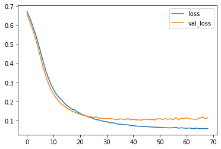

```python
import pandas as pd
import numpy as np
import matplotlib.pyplot as plt
import seaborn as sns
```


```python
data = pd.read_csv('cancer_classification.csv');
```


```python
data.info()
```

    <class 'pandas.core.frame.DataFrame'>
    RangeIndex: 569 entries, 0 to 568
    Data columns (total 31 columns):
     #   Column                   Non-Null Count  Dtype  
    ---  ------                   --------------  -----  
     0   mean radius              569 non-null    float64
     1   mean texture             569 non-null    float64
     2   mean perimeter           569 non-null    float64
     3   mean area                569 non-null    float64
     4   mean smoothness          569 non-null    float64
     5   mean compactness         569 non-null    float64
     6   mean concavity           569 non-null    float64
     7   mean concave points      569 non-null    float64
     8   mean symmetry            569 non-null    float64
     9   mean fractal dimension   569 non-null    float64
     10  radius error             569 non-null    float64
     11  texture error            569 non-null    float64
     12  perimeter error          569 non-null    float64
     13  area error               569 non-null    float64
     14  smoothness error         569 non-null    float64
     15  compactness error        569 non-null    float64
     16  concavity error          569 non-null    float64
     17  concave points error     569 non-null    float64
     18  symmetry error           569 non-null    float64
     19  fractal dimension error  569 non-null    float64
     20  worst radius             569 non-null    float64
     21  worst texture            569 non-null    float64
     22  worst perimeter          569 non-null    float64
     23  worst area               569 non-null    float64
     24  worst smoothness         569 non-null    float64
     25  worst compactness        569 non-null    float64
     26  worst concavity          569 non-null    float64
     27  worst concave points     569 non-null    float64
     28  worst symmetry           569 non-null    float64
     29  worst fractal dimension  569 non-null    float64
     30  benign_0__mal_1          569 non-null    int64  
    dtypes: float64(30), int64(1)
    memory usage: 137.9 KB
    


```python
data.describe().transpose()
```


<div>
<style scoped>
    .dataframe tbody tr th:only-of-type {
        vertical-align: middle;
    }

    .dataframe tbody tr th {
        vertical-align: top;
    }

    .dataframe thead th {
        text-align: right;
    }
</style>
<table border="1" class="dataframe">
  <thead>
    <tr style="text-align: right;">
      <th></th>
      <th>count</th>
      <th>mean</th>
      <th>std</th>
      <th>min</th>
      <th>25%</th>
      <th>50%</th>
      <th>75%</th>
      <th>max</th>
    </tr>
  </thead>
  <tbody>
    <tr>
      <th>mean radius</th>
      <td>569.0</td>
      <td>14.127292</td>
      <td>3.524049</td>
      <td>6.981000</td>
      <td>11.700000</td>
      <td>13.370000</td>
      <td>15.780000</td>
      <td>28.11000</td>
    </tr>
    <tr>
      <th>mean texture</th>
      <td>569.0</td>
      <td>19.289649</td>
      <td>4.301036</td>
      <td>9.710000</td>
      <td>16.170000</td>
      <td>18.840000</td>
      <td>21.800000</td>
      <td>39.28000</td>
    </tr>
    <tr>
      <th>mean perimeter</th>
      <td>569.0</td>
      <td>91.969033</td>
      <td>24.298981</td>
      <td>43.790000</td>
      <td>75.170000</td>
      <td>86.240000</td>
      <td>104.100000</td>
      <td>188.50000</td>
    </tr>
    <tr>
      <th>mean area</th>
      <td>569.0</td>
      <td>654.889104</td>
      <td>351.914129</td>
      <td>143.500000</td>
      <td>420.300000</td>
      <td>551.100000</td>
      <td>782.700000</td>
      <td>2501.00000</td>
    </tr>
    <tr>
      <th>mean smoothness</th>
      <td>569.0</td>
      <td>0.096360</td>
      <td>0.014064</td>
      <td>0.052630</td>
      <td>0.086370</td>
      <td>0.095870</td>
      <td>0.105300</td>
      <td>0.16340</td>
    </tr>
    <tr>
      <th>mean compactness</th>
      <td>569.0</td>
      <td>0.104341</td>
      <td>0.052813</td>
      <td>0.019380</td>
      <td>0.064920</td>
      <td>0.092630</td>
      <td>0.130400</td>
      <td>0.34540</td>
    </tr>
    <tr>
      <th>mean concavity</th>
      <td>569.0</td>
      <td>0.088799</td>
      <td>0.079720</td>
      <td>0.000000</td>
      <td>0.029560</td>
      <td>0.061540</td>
      <td>0.130700</td>
      <td>0.42680</td>
    </tr>
    <tr>
      <th>mean concave points</th>
      <td>569.0</td>
      <td>0.048919</td>
      <td>0.038803</td>
      <td>0.000000</td>
      <td>0.020310</td>
      <td>0.033500</td>
      <td>0.074000</td>
      <td>0.20120</td>
    </tr>
    <tr>
      <th>mean symmetry</th>
      <td>569.0</td>
      <td>0.181162</td>
      <td>0.027414</td>
      <td>0.106000</td>
      <td>0.161900</td>
      <td>0.179200</td>
      <td>0.195700</td>
      <td>0.30400</td>
    </tr>
    <tr>
      <th>mean fractal dimension</th>
      <td>569.0</td>
      <td>0.062798</td>
      <td>0.007060</td>
      <td>0.049960</td>
      <td>0.057700</td>
      <td>0.061540</td>
      <td>0.066120</td>
      <td>0.09744</td>
    </tr>
    <tr>
      <th>radius error</th>
      <td>569.0</td>
      <td>0.405172</td>
      <td>0.277313</td>
      <td>0.111500</td>
      <td>0.232400</td>
      <td>0.324200</td>
      <td>0.478900</td>
      <td>2.87300</td>
    </tr>
    <tr>
      <th>texture error</th>
      <td>569.0</td>
      <td>1.216853</td>
      <td>0.551648</td>
      <td>0.360200</td>
      <td>0.833900</td>
      <td>1.108000</td>
      <td>1.474000</td>
      <td>4.88500</td>
    </tr>
    <tr>
      <th>perimeter error</th>
      <td>569.0</td>
      <td>2.866059</td>
      <td>2.021855</td>
      <td>0.757000</td>
      <td>1.606000</td>
      <td>2.287000</td>
      <td>3.357000</td>
      <td>21.98000</td>
    </tr>
    <tr>
      <th>area error</th>
      <td>569.0</td>
      <td>40.337079</td>
      <td>45.491006</td>
      <td>6.802000</td>
      <td>17.850000</td>
      <td>24.530000</td>
      <td>45.190000</td>
      <td>542.20000</td>
    </tr>
    <tr>
      <th>smoothness error</th>
      <td>569.0</td>
      <td>0.007041</td>
      <td>0.003003</td>
      <td>0.001713</td>
      <td>0.005169</td>
      <td>0.006380</td>
      <td>0.008146</td>
      <td>0.03113</td>
    </tr>
    <tr>
      <th>compactness error</th>
      <td>569.0</td>
      <td>0.025478</td>
      <td>0.017908</td>
      <td>0.002252</td>
      <td>0.013080</td>
      <td>0.020450</td>
      <td>0.032450</td>
      <td>0.13540</td>
    </tr>
    <tr>
      <th>concavity error</th>
      <td>569.0</td>
      <td>0.031894</td>
      <td>0.030186</td>
      <td>0.000000</td>
      <td>0.015090</td>
      <td>0.025890</td>
      <td>0.042050</td>
      <td>0.39600</td>
    </tr>
    <tr>
      <th>concave points error</th>
      <td>569.0</td>
      <td>0.011796</td>
      <td>0.006170</td>
      <td>0.000000</td>
      <td>0.007638</td>
      <td>0.010930</td>
      <td>0.014710</td>
      <td>0.05279</td>
    </tr>
    <tr>
      <th>symmetry error</th>
      <td>569.0</td>
      <td>0.020542</td>
      <td>0.008266</td>
      <td>0.007882</td>
      <td>0.015160</td>
      <td>0.018730</td>
      <td>0.023480</td>
      <td>0.07895</td>
    </tr>
    <tr>
      <th>fractal dimension error</th>
      <td>569.0</td>
      <td>0.003795</td>
      <td>0.002646</td>
      <td>0.000895</td>
      <td>0.002248</td>
      <td>0.003187</td>
      <td>0.004558</td>
      <td>0.02984</td>
    </tr>
    <tr>
      <th>worst radius</th>
      <td>569.0</td>
      <td>16.269190</td>
      <td>4.833242</td>
      <td>7.930000</td>
      <td>13.010000</td>
      <td>14.970000</td>
      <td>18.790000</td>
      <td>36.04000</td>
    </tr>
    <tr>
      <th>worst texture</th>
      <td>569.0</td>
      <td>25.677223</td>
      <td>6.146258</td>
      <td>12.020000</td>
      <td>21.080000</td>
      <td>25.410000</td>
      <td>29.720000</td>
      <td>49.54000</td>
    </tr>
    <tr>
      <th>worst perimeter</th>
      <td>569.0</td>
      <td>107.261213</td>
      <td>33.602542</td>
      <td>50.410000</td>
      <td>84.110000</td>
      <td>97.660000</td>
      <td>125.400000</td>
      <td>251.20000</td>
    </tr>
    <tr>
      <th>worst area</th>
      <td>569.0</td>
      <td>880.583128</td>
      <td>569.356993</td>
      <td>185.200000</td>
      <td>515.300000</td>
      <td>686.500000</td>
      <td>1084.000000</td>
      <td>4254.00000</td>
    </tr>
    <tr>
      <th>worst smoothness</th>
      <td>569.0</td>
      <td>0.132369</td>
      <td>0.022832</td>
      <td>0.071170</td>
      <td>0.116600</td>
      <td>0.131300</td>
      <td>0.146000</td>
      <td>0.22260</td>
    </tr>
    <tr>
      <th>worst compactness</th>
      <td>569.0</td>
      <td>0.254265</td>
      <td>0.157336</td>
      <td>0.027290</td>
      <td>0.147200</td>
      <td>0.211900</td>
      <td>0.339100</td>
      <td>1.05800</td>
    </tr>
    <tr>
      <th>worst concavity</th>
      <td>569.0</td>
      <td>0.272188</td>
      <td>0.208624</td>
      <td>0.000000</td>
      <td>0.114500</td>
      <td>0.226700</td>
      <td>0.382900</td>
      <td>1.25200</td>
    </tr>
    <tr>
      <th>worst concave points</th>
      <td>569.0</td>
      <td>0.114606</td>
      <td>0.065732</td>
      <td>0.000000</td>
      <td>0.064930</td>
      <td>0.099930</td>
      <td>0.161400</td>
      <td>0.29100</td>
    </tr>
    <tr>
      <th>worst symmetry</th>
      <td>569.0</td>
      <td>0.290076</td>
      <td>0.061867</td>
      <td>0.156500</td>
      <td>0.250400</td>
      <td>0.282200</td>
      <td>0.317900</td>
      <td>0.66380</td>
    </tr>
    <tr>
      <th>worst fractal dimension</th>
      <td>569.0</td>
      <td>0.083946</td>
      <td>0.018061</td>
      <td>0.055040</td>
      <td>0.071460</td>
      <td>0.080040</td>
      <td>0.092080</td>
      <td>0.20750</td>
    </tr>
    <tr>
      <th>benign_0__mal_1</th>
      <td>569.0</td>
      <td>0.627417</td>
      <td>0.483918</td>
      <td>0.000000</td>
      <td>0.000000</td>
      <td>1.000000</td>
      <td>1.000000</td>
      <td>1.00000</td>
    </tr>
  </tbody>
</table>
</div>


```python
data
```


<div>
<style scoped>
    .dataframe tbody tr th:only-of-type {
        vertical-align: middle;
    }

    .dataframe tbody tr th {
        vertical-align: top;
    }

    .dataframe thead th {
        text-align: right;
    }
</style>
<table border="1" class="dataframe">
  <thead>
    <tr style="text-align: right;">
      <th></th>
      <th>mean radius</th>
      <th>mean texture</th>
      <th>mean perimeter</th>
      <th>mean area</th>
      <th>mean smoothness</th>
      <th>mean compactness</th>
      <th>mean concavity</th>
      <th>mean concave points</th>
      <th>mean symmetry</th>
      <th>mean fractal dimension</th>
      <th>...</th>
      <th>worst texture</th>
      <th>worst perimeter</th>
      <th>worst area</th>
      <th>worst smoothness</th>
      <th>worst compactness</th>
      <th>worst concavity</th>
      <th>worst concave points</th>
      <th>worst symmetry</th>
      <th>worst fractal dimension</th>
      <th>benign_0__mal_1</th>
    </tr>
  </thead>
  <tbody>
    <tr>
      <th>0</th>
      <td>17.99</td>
      <td>10.38</td>
      <td>122.80</td>
      <td>1001.0</td>
      <td>0.11840</td>
      <td>0.27760</td>
      <td>0.30010</td>
      <td>0.14710</td>
      <td>0.2419</td>
      <td>0.07871</td>
      <td>...</td>
      <td>17.33</td>
      <td>184.60</td>
      <td>2019.0</td>
      <td>0.16220</td>
      <td>0.66560</td>
      <td>0.7119</td>
      <td>0.2654</td>
      <td>0.4601</td>
      <td>0.11890</td>
      <td>0</td>
    </tr>
    <tr>
      <th>1</th>
      <td>20.57</td>
      <td>17.77</td>
      <td>132.90</td>
      <td>1326.0</td>
      <td>0.08474</td>
      <td>0.07864</td>
      <td>0.08690</td>
      <td>0.07017</td>
      <td>0.1812</td>
      <td>0.05667</td>
      <td>...</td>
      <td>23.41</td>
      <td>158.80</td>
      <td>1956.0</td>
      <td>0.12380</td>
      <td>0.18660</td>
      <td>0.2416</td>
      <td>0.1860</td>
      <td>0.2750</td>
      <td>0.08902</td>
      <td>0</td>
    </tr>
    <tr>
      <th>2</th>
      <td>19.69</td>
      <td>21.25</td>
      <td>130.00</td>
      <td>1203.0</td>
      <td>0.10960</td>
      <td>0.15990</td>
      <td>0.19740</td>
      <td>0.12790</td>
      <td>0.2069</td>
      <td>0.05999</td>
      <td>...</td>
      <td>25.53</td>
      <td>152.50</td>
      <td>1709.0</td>
      <td>0.14440</td>
      <td>0.42450</td>
      <td>0.4504</td>
      <td>0.2430</td>
      <td>0.3613</td>
      <td>0.08758</td>
      <td>0</td>
    </tr>
    <tr>
      <th>3</th>
      <td>11.42</td>
      <td>20.38</td>
      <td>77.58</td>
      <td>386.1</td>
      <td>0.14250</td>
      <td>0.28390</td>
      <td>0.24140</td>
      <td>0.10520</td>
      <td>0.2597</td>
      <td>0.09744</td>
      <td>...</td>
      <td>26.50</td>
      <td>98.87</td>
      <td>567.7</td>
      <td>0.20980</td>
      <td>0.86630</td>
      <td>0.6869</td>
      <td>0.2575</td>
      <td>0.6638</td>
      <td>0.17300</td>
      <td>0</td>
    </tr>
    <tr>
      <th>4</th>
      <td>20.29</td>
      <td>14.34</td>
      <td>135.10</td>
      <td>1297.0</td>
      <td>0.10030</td>
      <td>0.13280</td>
      <td>0.19800</td>
      <td>0.10430</td>
      <td>0.1809</td>
      <td>0.05883</td>
      <td>...</td>
      <td>16.67</td>
      <td>152.20</td>
      <td>1575.0</td>
      <td>0.13740</td>
      <td>0.20500</td>
      <td>0.4000</td>
      <td>0.1625</td>
      <td>0.2364</td>
      <td>0.07678</td>
      <td>0</td>
    </tr>
    <tr>
      <th>...</th>
      <td>...</td>
      <td>...</td>
      <td>...</td>
      <td>...</td>
      <td>...</td>
      <td>...</td>
      <td>...</td>
      <td>...</td>
      <td>...</td>
      <td>...</td>
      <td>...</td>
      <td>...</td>
      <td>...</td>
      <td>...</td>
      <td>...</td>
      <td>...</td>
      <td>...</td>
      <td>...</td>
      <td>...</td>
      <td>...</td>
      <td>...</td>
    </tr>
    <tr>
      <th>564</th>
      <td>21.56</td>
      <td>22.39</td>
      <td>142.00</td>
      <td>1479.0</td>
      <td>0.11100</td>
      <td>0.11590</td>
      <td>0.24390</td>
      <td>0.13890</td>
      <td>0.1726</td>
      <td>0.05623</td>
      <td>...</td>
      <td>26.40</td>
      <td>166.10</td>
      <td>2027.0</td>
      <td>0.14100</td>
      <td>0.21130</td>
      <td>0.4107</td>
      <td>0.2216</td>
      <td>0.2060</td>
      <td>0.07115</td>
      <td>0</td>
    </tr>
    <tr>
      <th>565</th>
      <td>20.13</td>
      <td>28.25</td>
      <td>131.20</td>
      <td>1261.0</td>
      <td>0.09780</td>
      <td>0.10340</td>
      <td>0.14400</td>
      <td>0.09791</td>
      <td>0.1752</td>
      <td>0.05533</td>
      <td>...</td>
      <td>38.25</td>
      <td>155.00</td>
      <td>1731.0</td>
      <td>0.11660</td>
      <td>0.19220</td>
      <td>0.3215</td>
      <td>0.1628</td>
      <td>0.2572</td>
      <td>0.06637</td>
      <td>0</td>
    </tr>
    <tr>
      <th>566</th>
      <td>16.60</td>
      <td>28.08</td>
      <td>108.30</td>
      <td>858.1</td>
      <td>0.08455</td>
      <td>0.10230</td>
      <td>0.09251</td>
      <td>0.05302</td>
      <td>0.1590</td>
      <td>0.05648</td>
      <td>...</td>
      <td>34.12</td>
      <td>126.70</td>
      <td>1124.0</td>
      <td>0.11390</td>
      <td>0.30940</td>
      <td>0.3403</td>
      <td>0.1418</td>
      <td>0.2218</td>
      <td>0.07820</td>
      <td>0</td>
    </tr>
    <tr>
      <th>567</th>
      <td>20.60</td>
      <td>29.33</td>
      <td>140.10</td>
      <td>1265.0</td>
      <td>0.11780</td>
      <td>0.27700</td>
      <td>0.35140</td>
      <td>0.15200</td>
      <td>0.2397</td>
      <td>0.07016</td>
      <td>...</td>
      <td>39.42</td>
      <td>184.60</td>
      <td>1821.0</td>
      <td>0.16500</td>
      <td>0.86810</td>
      <td>0.9387</td>
      <td>0.2650</td>
      <td>0.4087</td>
      <td>0.12400</td>
      <td>0</td>
    </tr>
    <tr>
      <th>568</th>
      <td>7.76</td>
      <td>24.54</td>
      <td>47.92</td>
      <td>181.0</td>
      <td>0.05263</td>
      <td>0.04362</td>
      <td>0.00000</td>
      <td>0.00000</td>
      <td>0.1587</td>
      <td>0.05884</td>
      <td>...</td>
      <td>30.37</td>
      <td>59.16</td>
      <td>268.6</td>
      <td>0.08996</td>
      <td>0.06444</td>
      <td>0.0000</td>
      <td>0.0000</td>
      <td>0.2871</td>
      <td>0.07039</td>
      <td>1</td>
    </tr>
  </tbody>
</table>
<p>569 rows × 31 columns</p>
</div>


```python
sns.countplot(x='benign_0__mal_1', data=data)
```


    <AxesSubplot:xlabel='benign_0__mal_1', ylabel='count'>


    

    


```python
data.corr()['benign_0__mal_1'].sort_values()
```


    worst concave points      -0.793566
    worst perimeter           -0.782914
    mean concave points       -0.776614
    worst radius              -0.776454
    mean perimeter            -0.742636
    worst area                -0.733825
    mean radius               -0.730029
    mean area                 -0.708984
    mean concavity            -0.696360
    worst concavity           -0.659610
    mean compactness          -0.596534
    worst compactness         -0.590998
    radius error              -0.567134
    perimeter error           -0.556141
    area error                -0.548236
    worst texture             -0.456903
    worst smoothness          -0.421465
    worst symmetry            -0.416294
    mean texture              -0.415185
    concave points error      -0.408042
    mean smoothness           -0.358560
    mean symmetry             -0.330499
    worst fractal dimension   -0.323872
    compactness error         -0.292999
    concavity error           -0.253730
    fractal dimension error   -0.077972
    symmetry error             0.006522
    texture error              0.008303
    mean fractal dimension     0.012838
    smoothness error           0.067016
    benign_0__mal_1            1.000000
    Name: benign_0__mal_1, dtype: float64


```python
data.corr()['benign_0__mal_1'][:-1].sort_values().plot(kind='bar')
```


    <AxesSubplot:>


    

    


```python
sns.heatmap(data.corr())
```


    <AxesSubplot:>


    

    


```python
X = data.drop('benign_0__mal_1', axis=1).values
```


```python
y = data['benign_0__mal_1'].values
```


```python
# Data split
from sklearn.model_selection import train_test_split
```


```python
X_train, X_test, y_train, y_test = train_test_split(X, y, test_size=0.25, random_state=101)
```


```python
# data scaling
from sklearn.preprocessing import MinMaxScaler
```


```python
scaler = MinMaxScaler()
```


```python
X_train = scaler.fit_transform(X_train)
```


```python
X_test = scaler.transform(X_test)
```


```python
# Modeling
```


```python
from tensorflow.keras.models import Sequential
```


```python
from tensorflow.keras.layers import Dense, Dropout
```


```python
X_train.shape
```


    (426, 30)


```python
model = Sequential()

model.add(Dense(30, activation='relu'))
model.add(Dense(15, activation='relu'))

# binary classification
model.add(Dense(1, activation='sigmoid'))
```


```python
model.compile(loss='binary_crossentropy', optimizer='adam')
```


```python
model.fit(x=X_train, y=y_train, epochs=600, validation_data=(X_test, y_test), verbose=0)
```


    <tensorflow.python.keras.callbacks.History at 0x1ce0eb07e50>


```python
losses = pd.DataFrame(model.history.history)
```


```python
losses
```


<div>
<style scoped>
    .dataframe tbody tr th:only-of-type {
        vertical-align: middle;
    }

    .dataframe tbody tr th {
        vertical-align: top;
    }

    .dataframe thead th {
        text-align: right;
    }
</style>
<table border="1" class="dataframe">
  <thead>
    <tr style="text-align: right;">
      <th></th>
      <th>loss</th>
      <th>val_loss</th>
    </tr>
  </thead>
  <tbody>
    <tr>
      <th>0</th>
      <td>0.671375</td>
      <td>0.643661</td>
    </tr>
    <tr>
      <th>1</th>
      <td>0.627768</td>
      <td>0.604877</td>
    </tr>
    <tr>
      <th>2</th>
      <td>0.590303</td>
      <td>0.566539</td>
    </tr>
    <tr>
      <th>3</th>
      <td>0.548458</td>
      <td>0.524710</td>
    </tr>
    <tr>
      <th>4</th>
      <td>0.507412</td>
      <td>0.482255</td>
    </tr>
    <tr>
      <th>...</th>
      <td>...</td>
      <td>...</td>
    </tr>
    <tr>
      <th>595</th>
      <td>0.002506</td>
      <td>0.196258</td>
    </tr>
    <tr>
      <th>596</th>
      <td>0.002026</td>
      <td>0.179407</td>
    </tr>
    <tr>
      <th>597</th>
      <td>0.002207</td>
      <td>0.193187</td>
    </tr>
    <tr>
      <th>598</th>
      <td>0.002154</td>
      <td>0.187467</td>
    </tr>
    <tr>
      <th>599</th>
      <td>0.001954</td>
      <td>0.186433</td>
    </tr>
  </tbody>
</table>
<p>600 rows × 2 columns</p>
</div>


```python
losses.plot()
```


    <AxesSubplot:>


    

    


```python
# For early stopping

model = Sequential()

model.add(Dense(30, activation='relu'))
model.add(Dense(15, activation='relu'))

# binary classification
model.add(Dense(1, activation='sigmoid'))
model.compile(loss='binary_crossentropy', optimizer='adam')
```


```python
from tensorflow.keras.callbacks import EarlyStopping
```


```python
# track the validation_loss -> monitor
# monitor val_loss try to minimize it, patience = 25, wait for 25 epochs
early_stop = EarlyStopping(monitor='val_loss', mode='min', verbose=1, patience = 25)
```


```python
model.fit(x=X_train, y=y_train, epochs=600, validation_data=(X_test, y_test), callbacks=[early_stop])
```

    Epoch 1/600
    14/14 [==============================] - 0s 10ms/step - loss: 0.6721 - val_loss: 0.6567
    Epoch 2/600
    14/14 [==============================] - 0s 2ms/step - loss: 0.6399 - val_loss: 0.6217
    Epoch 3/600
    14/14 [==============================] - 0s 2ms/step - loss: 0.6026 - val_loss: 0.5819
    Epoch 4/600
    14/14 [==============================] - 0s 2ms/step - loss: 0.5621 - val_loss: 0.5387
    Epoch 5/600
    14/14 [==============================] - 0s 2ms/step - loss: 0.5159 - val_loss: 0.4903
    Epoch 6/600
    14/14 [==============================] - 0s 2ms/step - loss: 0.4664 - val_loss: 0.4373
    Epoch 7/600
    14/14 [==============================] - 0s 2ms/step - loss: 0.4140 - val_loss: 0.3819
    Epoch 8/600
    14/14 [==============================] - 0s 2ms/step - loss: 0.3646 - val_loss: 0.3348
    Epoch 9/600
    14/14 [==============================] - 0s 6ms/step - loss: 0.3238 - val_loss: 0.2970
    Epoch 10/600
    14/14 [==============================] - 0s 4ms/step - loss: 0.2895 - val_loss: 0.2643
    Epoch 11/600
    14/14 [==============================] - 0s 2ms/step - loss: 0.2625 - val_loss: 0.2405
    Epoch 12/600
    14/14 [==============================] - 0s 3ms/step - loss: 0.2387 - val_loss: 0.2167
    Epoch 13/600
    14/14 [==============================] - 0s 2ms/step - loss: 0.2203 - val_loss: 0.1992
    Epoch 14/600
    14/14 [==============================] - 0s 3ms/step - loss: 0.2080 - val_loss: 0.1855
    Epoch 15/600
    14/14 [==============================] - 0s 2ms/step - loss: 0.1916 - val_loss: 0.1759
    Epoch 16/600
    14/14 [==============================] - 0s 2ms/step - loss: 0.1781 - val_loss: 0.1637
    Epoch 17/600
    14/14 [==============================] - 0s 2ms/step - loss: 0.1685 - val_loss: 0.1558
    Epoch 18/600
    14/14 [==============================] - 0s 2ms/step - loss: 0.1586 - val_loss: 0.1489
    Epoch 19/600
    14/14 [==============================] - 0s 2ms/step - loss: 0.1550 - val_loss: 0.1431
    Epoch 20/600
    14/14 [==============================] - 0s 2ms/step - loss: 0.1441 - val_loss: 0.1365
    Epoch 21/600
    14/14 [==============================] - 0s 2ms/step - loss: 0.1366 - val_loss: 0.1328
    Epoch 22/600
    14/14 [==============================] - 0s 2ms/step - loss: 0.1293 - val_loss: 0.1272
    Epoch 23/600
    14/14 [==============================] - 0s 2ms/step - loss: 0.1246 - val_loss: 0.1256
    Epoch 24/600
    14/14 [==============================] - 0s 2ms/step - loss: 0.1185 - val_loss: 0.1197
    Epoch 25/600
    14/14 [==============================] - 0s 2ms/step - loss: 0.1155 - val_loss: 0.1189
    Epoch 26/600
    14/14 [==============================] - 0s 2ms/step - loss: 0.1095 - val_loss: 0.1156
    Epoch 27/600
    14/14 [==============================] - 0s 2ms/step - loss: 0.1039 - val_loss: 0.1183
    Epoch 28/600
    14/14 [==============================] - 0s 3ms/step - loss: 0.1027 - val_loss: 0.1126
    Epoch 29/600
    14/14 [==============================] - 0s 3ms/step - loss: 0.0979 - val_loss: 0.1109
    Epoch 30/600
    14/14 [==============================] - 0s 2ms/step - loss: 0.0947 - val_loss: 0.1103
    Epoch 31/600
    14/14 [==============================] - 0s 2ms/step - loss: 0.0930 - val_loss: 0.1088
    Epoch 32/600
    14/14 [==============================] - 0s 2ms/step - loss: 0.0875 - val_loss: 0.1105
    Epoch 33/600
    14/14 [==============================] - 0s 2ms/step - loss: 0.0867 - val_loss: 0.1081
    Epoch 34/600
    14/14 [==============================] - 0s 2ms/step - loss: 0.0862 - val_loss: 0.1061
    Epoch 35/600
    14/14 [==============================] - 0s 2ms/step - loss: 0.0807 - val_loss: 0.1035
    Epoch 36/600
    14/14 [==============================] - 0s 2ms/step - loss: 0.0801 - val_loss: 0.1076
    Epoch 37/600
    14/14 [==============================] - 0s 2ms/step - loss: 0.0794 - val_loss: 0.1073
    Epoch 38/600
    14/14 [==============================] - 0s 2ms/step - loss: 0.0766 - val_loss: 0.1031
    Epoch 39/600
    14/14 [==============================] - 0s 2ms/step - loss: 0.0772 - val_loss: 0.1099
    Epoch 40/600
    14/14 [==============================] - 0s 2ms/step - loss: 0.0723 - val_loss: 0.1027
    Epoch 41/600
    14/14 [==============================] - 0s 2ms/step - loss: 0.0727 - val_loss: 0.1050
    Epoch 42/600
    14/14 [==============================] - 0s 2ms/step - loss: 0.0705 - val_loss: 0.1031
    Epoch 43/600
    14/14 [==============================] - 0s 2ms/step - loss: 0.0690 - val_loss: 0.1027
    Epoch 44/600
    14/14 [==============================] - 0s 2ms/step - loss: 0.0681 - val_loss: 0.1011
    Epoch 45/600
    14/14 [==============================] - 0s 2ms/step - loss: 0.0676 - val_loss: 0.1051
    Epoch 46/600
    14/14 [==============================] - 0s 2ms/step - loss: 0.0682 - val_loss: 0.1063
    Epoch 47/600
    14/14 [==============================] - 0s 2ms/step - loss: 0.0661 - val_loss: 0.1038
    Epoch 48/600
    14/14 [==============================] - 0s 2ms/step - loss: 0.0653 - val_loss: 0.1050
    Epoch 49/600
    14/14 [==============================] - 0s 2ms/step - loss: 0.0647 - val_loss: 0.1020
    Epoch 50/600
    14/14 [==============================] - 0s 2ms/step - loss: 0.0637 - val_loss: 0.1075
    Epoch 51/600
    14/14 [==============================] - 0s 2ms/step - loss: 0.0633 - val_loss: 0.1093
    Epoch 52/600
    14/14 [==============================] - 0s 2ms/step - loss: 0.0624 - val_loss: 0.1044
    Epoch 53/600
    14/14 [==============================] - 0s 2ms/step - loss: 0.0616 - val_loss: 0.1090
    Epoch 54/600
    14/14 [==============================] - 0s 2ms/step - loss: 0.0610 - val_loss: 0.1063
    Epoch 55/600
    14/14 [==============================] - 0s 2ms/step - loss: 0.0607 - val_loss: 0.1083
    Epoch 56/600
    14/14 [==============================] - 0s 2ms/step - loss: 0.0615 - val_loss: 0.1036
    Epoch 57/600
    14/14 [==============================] - 0s 2ms/step - loss: 0.0633 - val_loss: 0.1148
    Epoch 58/600
    14/14 [==============================] - 0s 2ms/step - loss: 0.0592 - val_loss: 0.1026
    Epoch 59/600
    14/14 [==============================] - 0s 2ms/step - loss: 0.0610 - val_loss: 0.1118
    Epoch 60/600
    14/14 [==============================] - 0s 2ms/step - loss: 0.0596 - val_loss: 0.1099
    Epoch 61/600
    14/14 [==============================] - 0s 2ms/step - loss: 0.0584 - val_loss: 0.1134
    Epoch 62/600
    14/14 [==============================] - 0s 2ms/step - loss: 0.0602 - val_loss: 0.1088
    Epoch 63/600
    14/14 [==============================] - 0s 2ms/step - loss: 0.0578 - val_loss: 0.1074
    Epoch 64/600
    14/14 [==============================] - 0s 2ms/step - loss: 0.0570 - val_loss: 0.1062
    Epoch 65/600
    14/14 [==============================] - 0s 5ms/step - loss: 0.0593 - val_loss: 0.1061
    Epoch 66/600
    14/14 [==============================] - 0s 2ms/step - loss: 0.0560 - val_loss: 0.1123
    Epoch 67/600
    14/14 [==============================] - 0s 2ms/step - loss: 0.0576 - val_loss: 0.1174
    Epoch 68/600
    14/14 [==============================] - 0s 3ms/step - loss: 0.0563 - val_loss: 0.1085
    Epoch 69/600
    14/14 [==============================] - 0s 6ms/step - loss: 0.0575 - val_loss: 0.1147
    Epoch 00069: early stopping
    


    <tensorflow.python.keras.callbacks.History at 0x1ce0eeff790>


```python
model_loss = pd.DataFrame(model.history.history)
model_loss.plot()
```


    <AxesSubplot:>


    

    


```python
from tensorflow.keras.layers import Dropout
```


```python
# Droping out layers

model = Sequential()

model.add(Dense(30, activation='relu'))
model.add(Dropout(.5)) # drop out rate -> dropout 50% of neurons (probability)

model.add(Dense(15, activation='relu'))
model.add(Dropout(.5))

# binary classification
model.add(Dense(1, activation='sigmoid'))

model.compile(loss='binary_crossentropy', optimizer='adam')
```


```python
model.fit(x=X_train, y=y_train, epochs=600, validation_data=(X_test, y_test), callbacks=[early_stop])
```

    Epoch 1/600
    14/14 [==============================] - 0s 13ms/step - loss: 0.7059 - val_loss: 0.6794
    Epoch 2/600
    14/14 [==============================] - 0s 2ms/step - loss: 0.6644 - val_loss: 0.6654
    Epoch 3/600
    14/14 [==============================] - 0s 2ms/step - loss: 0.6578 - val_loss: 0.6535
    Epoch 4/600
    14/14 [==============================] - 0s 3ms/step - loss: 0.6355 - val_loss: 0.6320
    Epoch 5/600
    14/14 [==============================] - 0s 3ms/step - loss: 0.6197 - val_loss: 0.6042
    Epoch 6/600
    14/14 [==============================] - 0s 2ms/step - loss: 0.6144 - val_loss: 0.5735
    Epoch 7/600
    14/14 [==============================] - 0s 3ms/step - loss: 0.5851 - val_loss: 0.5431
    Epoch 8/600
    14/14 [==============================] - 0s 2ms/step - loss: 0.5570 - val_loss: 0.5075
    Epoch 9/600
    14/14 [==============================] - 0s 2ms/step - loss: 0.5579 - val_loss: 0.4817
    Epoch 10/600
    14/14 [==============================] - 0s 2ms/step - loss: 0.5288 - val_loss: 0.4572
    Epoch 11/600
    14/14 [==============================] - 0s 3ms/step - loss: 0.5178 - val_loss: 0.4185
    Epoch 12/600
    14/14 [==============================] - 0s 2ms/step - loss: 0.4849 - val_loss: 0.3943
    Epoch 13/600
    14/14 [==============================] - 0s 2ms/step - loss: 0.4661 - val_loss: 0.3741
    Epoch 14/600
    14/14 [==============================] - 0s 2ms/step - loss: 0.4383 - val_loss: 0.3520
    Epoch 15/600
    14/14 [==============================] - 0s 2ms/step - loss: 0.4261 - val_loss: 0.3347
    Epoch 16/600
    14/14 [==============================] - 0s 2ms/step - loss: 0.3896 - val_loss: 0.3066
    Epoch 17/600
    14/14 [==============================] - ETA: 0s - loss: 0.302 - 0s 2ms/step - loss: 0.3701 - val_loss: 0.2852
    Epoch 18/600
    14/14 [==============================] - 0s 2ms/step - loss: 0.3724 - val_loss: 0.2702
    Epoch 19/600
    14/14 [==============================] - 0s 2ms/step - loss: 0.3667 - val_loss: 0.2575
    Epoch 20/600
    14/14 [==============================] - 0s 4ms/step - loss: 0.3727 - val_loss: 0.2409
    Epoch 21/600
    14/14 [==============================] - 0s 6ms/step - loss: 0.3355 - val_loss: 0.2304
    Epoch 22/600
    14/14 [==============================] - 0s 7ms/step - loss: 0.3284 - val_loss: 0.2223
    Epoch 23/600
    14/14 [==============================] - 0s 7ms/step - loss: 0.3194 - val_loss: 0.2137
    Epoch 24/600
    14/14 [==============================] - 0s 6ms/step - loss: 0.3258 - val_loss: 0.2054
    Epoch 25/600
    14/14 [==============================] - 0s 4ms/step - loss: 0.3081 - val_loss: 0.1995
    Epoch 26/600
    14/14 [==============================] - 0s 4ms/step - loss: 0.2954 - val_loss: 0.1812
    Epoch 27/600
    14/14 [==============================] - 0s 6ms/step - loss: 0.2941 - val_loss: 0.1747
    Epoch 28/600
    14/14 [==============================] - 0s 4ms/step - loss: 0.2592 - val_loss: 0.1698
    Epoch 29/600
    14/14 [==============================] - 0s 4ms/step - loss: 0.2337 - val_loss: 0.1596
    Epoch 30/600
    14/14 [==============================] - 0s 4ms/step - loss: 0.2459 - val_loss: 0.1570
    Epoch 31/600
    14/14 [==============================] - 0s 4ms/step - loss: 0.2444 - val_loss: 0.1545
    Epoch 32/600
    14/14 [==============================] - 0s 4ms/step - loss: 0.2397 - val_loss: 0.1440
    Epoch 33/600
    14/14 [==============================] - 0s 3ms/step - loss: 0.2165 - val_loss: 0.1373
    Epoch 34/600
    14/14 [==============================] - 0s 3ms/step - loss: 0.2238 - val_loss: 0.1316
    Epoch 35/600
    14/14 [==============================] - 0s 3ms/step - loss: 0.2163 - val_loss: 0.1296
    Epoch 36/600
    14/14 [==============================] - 0s 3ms/step - loss: 0.2147 - val_loss: 0.1234
    Epoch 37/600
    14/14 [==============================] - 0s 3ms/step - loss: 0.2480 - val_loss: 0.1289
    Epoch 38/600
    14/14 [==============================] - 0s 3ms/step - loss: 0.2247 - val_loss: 0.1261
    Epoch 39/600
    14/14 [==============================] - 0s 3ms/step - loss: 0.2025 - val_loss: 0.1264
    Epoch 40/600
    14/14 [==============================] - 0s 3ms/step - loss: 0.1986 - val_loss: 0.1231
    Epoch 41/600
    14/14 [==============================] - 0s 3ms/step - loss: 0.1928 - val_loss: 0.1177
    Epoch 42/600
    14/14 [==============================] - 0s 3ms/step - loss: 0.1858 - val_loss: 0.1090
    Epoch 43/600
    14/14 [==============================] - 0s 3ms/step - loss: 0.2053 - val_loss: 0.1061
    Epoch 44/600
    14/14 [==============================] - 0s 5ms/step - loss: 0.1918 - val_loss: 0.1054
    Epoch 45/600
    14/14 [==============================] - 0s 3ms/step - loss: 0.1817 - val_loss: 0.1030
    Epoch 46/600
    14/14 [==============================] - 0s 4ms/step - loss: 0.1979 - val_loss: 0.1084
    Epoch 47/600
    14/14 [==============================] - 0s 4ms/step - loss: 0.1940 - val_loss: 0.1124
    Epoch 48/600
    14/14 [==============================] - 0s 4ms/step - loss: 0.1815 - val_loss: 0.1065
    Epoch 49/600
    14/14 [==============================] - 0s 4ms/step - loss: 0.1584 - val_loss: 0.1026
    Epoch 50/600
    14/14 [==============================] - 0s 2ms/step - loss: 0.1615 - val_loss: 0.0977
    Epoch 51/600
    14/14 [==============================] - 0s 2ms/step - loss: 0.1475 - val_loss: 0.0988
    Epoch 52/600
    14/14 [==============================] - 0s 4ms/step - loss: 0.1978 - val_loss: 0.1041
    Epoch 53/600
    14/14 [==============================] - 0s 5ms/step - loss: 0.1705 - val_loss: 0.0948
    Epoch 54/600
    14/14 [==============================] - 0s 5ms/step - loss: 0.1683 - val_loss: 0.1032
    Epoch 55/600
    14/14 [==============================] - 0s 5ms/step - loss: 0.1611 - val_loss: 0.0903
    Epoch 56/600
    14/14 [==============================] - 0s 5ms/step - loss: 0.1525 - val_loss: 0.0885
    Epoch 57/600
    14/14 [==============================] - 0s 5ms/step - loss: 0.1700 - val_loss: 0.0907
    Epoch 58/600
    14/14 [==============================] - 0s 6ms/step - loss: 0.1562 - val_loss: 0.0980
    Epoch 59/600
    14/14 [==============================] - 0s 5ms/step - loss: 0.1410 - val_loss: 0.0868
    Epoch 60/600
    14/14 [==============================] - 0s 4ms/step - loss: 0.1384 - val_loss: 0.0876
    Epoch 61/600
    14/14 [==============================] - 0s 4ms/step - loss: 0.1398 - val_loss: 0.0823
    Epoch 62/600
    14/14 [==============================] - 0s 6ms/step - loss: 0.1482 - val_loss: 0.0865
    Epoch 63/600
    14/14 [==============================] - 0s 6ms/step - loss: 0.1442 - val_loss: 0.0820
    Epoch 64/600
    14/14 [==============================] - 0s 6ms/step - loss: 0.1455 - val_loss: 0.0912
    Epoch 65/600
    14/14 [==============================] - 0s 4ms/step - loss: 0.1410 - val_loss: 0.0834
    Epoch 66/600
    14/14 [==============================] - 0s 4ms/step - loss: 0.1456 - val_loss: 0.0894
    Epoch 67/600
    14/14 [==============================] - 0s 4ms/step - loss: 0.1293 - val_loss: 0.0941
    Epoch 68/600
    14/14 [==============================] - 0s 4ms/step - loss: 0.1162 - val_loss: 0.0834
    Epoch 69/600
    14/14 [==============================] - 0s 4ms/step - loss: 0.1232 - val_loss: 0.0864
    Epoch 70/600
    14/14 [==============================] - 0s 4ms/step - loss: 0.1414 - val_loss: 0.0872
    Epoch 71/600
    14/14 [==============================] - 0s 4ms/step - loss: 0.1326 - val_loss: 0.0880
    Epoch 72/600
    14/14 [==============================] - 0s 4ms/step - loss: 0.1322 - val_loss: 0.0911
    Epoch 73/600
    14/14 [==============================] - 0s 3ms/step - loss: 0.1343 - val_loss: 0.0821
    Epoch 74/600
    14/14 [==============================] - 0s 3ms/step - loss: 0.1243 - val_loss: 0.0784
    Epoch 75/600
    14/14 [==============================] - 0s 3ms/step - loss: 0.1247 - val_loss: 0.0790
    Epoch 76/600
    14/14 [==============================] - 0s 3ms/step - loss: 0.1106 - val_loss: 0.0827
    Epoch 77/600
    14/14 [==============================] - 0s 6ms/step - loss: 0.1255 - val_loss: 0.0835
    Epoch 78/600
    14/14 [==============================] - 0s 5ms/step - loss: 0.1110 - val_loss: 0.0768
    Epoch 79/600
    14/14 [==============================] - 0s 3ms/step - loss: 0.1118 - val_loss: 0.0890
    Epoch 80/600
    14/14 [==============================] - 0s 3ms/step - loss: 0.1223 - val_loss: 0.0768
    Epoch 81/600
    14/14 [==============================] - 0s 4ms/step - loss: 0.1361 - val_loss: 0.0810
    Epoch 82/600
    14/14 [==============================] - 0s 4ms/step - loss: 0.1016 - val_loss: 0.0842
    Epoch 83/600
    14/14 [==============================] - 0s 4ms/step - loss: 0.1230 - val_loss: 0.0760
    Epoch 84/600
    14/14 [==============================] - 0s 4ms/step - loss: 0.0987 - val_loss: 0.0904
    Epoch 85/600
    14/14 [==============================] - 0s 3ms/step - loss: 0.1098 - val_loss: 0.0901
    Epoch 86/600
    14/14 [==============================] - 0s 4ms/step - loss: 0.1125 - val_loss: 0.0790
    Epoch 87/600
    14/14 [==============================] - 0s 4ms/step - loss: 0.1054 - val_loss: 0.0801
    Epoch 88/600
    14/14 [==============================] - 0s 4ms/step - loss: 0.1060 - val_loss: 0.0803
    Epoch 89/600
    14/14 [==============================] - 0s 4ms/step - loss: 0.1021 - val_loss: 0.0924
    Epoch 90/600
    14/14 [==============================] - 0s 6ms/step - loss: 0.1065 - val_loss: 0.0790
    Epoch 91/600
    14/14 [==============================] - 0s 4ms/step - loss: 0.1034 - val_loss: 0.0828
    Epoch 92/600
    14/14 [==============================] - 0s 4ms/step - loss: 0.1100 - val_loss: 0.0815
    Epoch 93/600
    14/14 [==============================] - 0s 6ms/step - loss: 0.1059 - val_loss: 0.0845
    Epoch 94/600
    14/14 [==============================] - 0s 6ms/step - loss: 0.0979 - val_loss: 0.0797
    Epoch 95/600
    14/14 [==============================] - 0s 4ms/step - loss: 0.1052 - val_loss: 0.0817
    Epoch 96/600
    14/14 [==============================] - 0s 4ms/step - loss: 0.1042 - val_loss: 0.0715
    Epoch 97/600
    14/14 [==============================] - 0s 5ms/step - loss: 0.0895 - val_loss: 0.0863
    Epoch 98/600
    14/14 [==============================] - 0s 4ms/step - loss: 0.0959 - val_loss: 0.0806
    Epoch 99/600
    14/14 [==============================] - 0s 3ms/step - loss: 0.0881 - val_loss: 0.0778
    Epoch 100/600
    14/14 [==============================] - 0s 3ms/step - loss: 0.0998 - val_loss: 0.0841
    Epoch 101/600
    14/14 [==============================] - 0s 3ms/step - loss: 0.0994 - val_loss: 0.0884
    Epoch 102/600
    14/14 [==============================] - 0s 3ms/step - loss: 0.1085 - val_loss: 0.0748
    Epoch 103/600
    14/14 [==============================] - 0s 3ms/step - loss: 0.0889 - val_loss: 0.0740
    Epoch 104/600
    14/14 [==============================] - 0s 3ms/step - loss: 0.0861 - val_loss: 0.0747
    Epoch 105/600
    14/14 [==============================] - 0s 3ms/step - loss: 0.1022 - val_loss: 0.0960
    Epoch 106/600
    14/14 [==============================] - 0s 6ms/step - loss: 0.1004 - val_loss: 0.0770
    Epoch 107/600
    14/14 [==============================] - 0s 6ms/step - loss: 0.1022 - val_loss: 0.0752
    Epoch 108/600
    14/14 [==============================] - 0s 3ms/step - loss: 0.1204 - val_loss: 0.0752
    Epoch 109/600
    14/14 [==============================] - 0s 5ms/step - loss: 0.0928 - val_loss: 0.0785
    Epoch 110/600
    14/14 [==============================] - 0s 4ms/step - loss: 0.0912 - val_loss: 0.0843
    Epoch 111/600
    14/14 [==============================] - 0s 4ms/step - loss: 0.0798 - val_loss: 0.0798
    Epoch 112/600
    14/14 [==============================] - 0s 3ms/step - loss: 0.0870 - val_loss: 0.0740
    Epoch 113/600
    14/14 [==============================] - 0s 4ms/step - loss: 0.0781 - val_loss: 0.0947
    Epoch 114/600
    14/14 [==============================] - 0s 4ms/step - loss: 0.1019 - val_loss: 0.0732
    Epoch 115/600
    14/14 [==============================] - 0s 4ms/step - loss: 0.0926 - val_loss: 0.0819
    Epoch 116/600
    14/14 [==============================] - 0s 4ms/step - loss: 0.1008 - val_loss: 0.0788
    Epoch 117/600
    14/14 [==============================] - 0s 3ms/step - loss: 0.0858 - val_loss: 0.0903
    Epoch 118/600
    14/14 [==============================] - 0s 4ms/step - loss: 0.0809 - val_loss: 0.0776
    Epoch 119/600
    14/14 [==============================] - 0s 4ms/step - loss: 0.0909 - val_loss: 0.0773
    Epoch 120/600
    14/14 [==============================] - 0s 4ms/step - loss: 0.0747 - val_loss: 0.0737
    Epoch 121/600
    14/14 [==============================] - 0s 4ms/step - loss: 0.0910 - val_loss: 0.0724
    Epoch 00121: early stopping
    


    <tensorflow.python.keras.callbacks.History at 0x1ce10963be0>


```python
model_losses = pd.DataFrame(model.history.history)
model_losses.plot()
```


    <AxesSubplot:>


    

    


```python
# Clasification
predictions = model.predict_classes(X_test)
```


```python
from sklearn.metrics import classification_report, confusion_matrix
```


```python
print(classification_report(y_test, predictions))
```

                  precision    recall  f1-score   support
    
               0       0.98      0.98      0.98        55
               1       0.99      0.99      0.99        88
    
        accuracy                           0.99       143
       macro avg       0.99      0.99      0.99       143
    weighted avg       0.99      0.99      0.99       143
    
    


```python
# show performance
print(confusion_matrix(y_test, predictions))
# we miss classifiy only 1 dataset
# 54,1 <--
# 1,87
```

    [[54  1]
     [ 1 87]]
    
