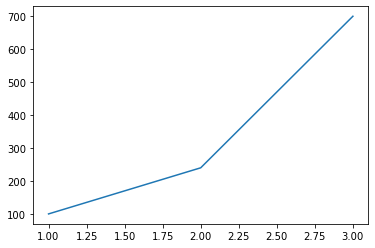
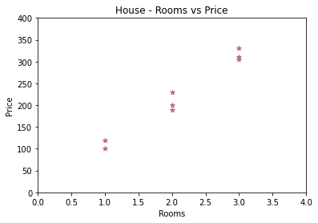
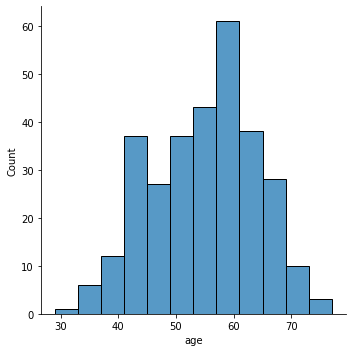
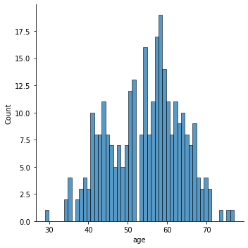
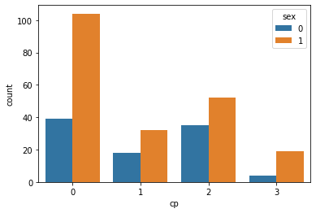
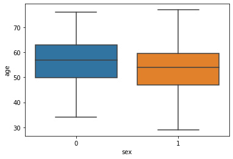
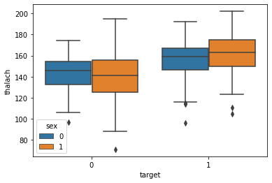

# Visualization

## Matblot Lib Basics


```python
import numpy as np
import pandas as pd
import matplotlib.pyplot as plt
```


```python
# Basic Plot
x = [1, 2, 3]
y = [100, 240, 700]

plt.plot(x, y)
plt.show() # when running from script
```


    

    


```python
# Simple scatter plot

housing = pd.DataFrame({
    'rooms': [1,1,2,2,2,3,3,3],
    'price': [100,120,190,200,230,310,330,305]
})
housing
```


<div>
<style scoped>
    .dataframe tbody tr th:only-of-type {
        vertical-align: middle;
    }

    .dataframe tbody tr th {
        vertical-align: top;
    }

    .dataframe thead th {
        text-align: right;
    }
</style>
<table border="1" class="dataframe">
  <thead>
    <tr style="text-align: right;">
      <th></th>
      <th>rooms</th>
      <th>price</th>
    </tr>
  </thead>
  <tbody>
    <tr>
      <th>0</th>
      <td>1</td>
      <td>100</td>
    </tr>
    <tr>
      <th>1</th>
      <td>1</td>
      <td>120</td>
    </tr>
    <tr>
      <th>2</th>
      <td>2</td>
      <td>190</td>
    </tr>
    <tr>
      <th>3</th>
      <td>2</td>
      <td>200</td>
    </tr>
    <tr>
      <th>4</th>
      <td>2</td>
      <td>230</td>
    </tr>
    <tr>
      <th>5</th>
      <td>3</td>
      <td>310</td>
    </tr>
    <tr>
      <th>6</th>
      <td>3</td>
      <td>330</td>
    </tr>
    <tr>
      <th>7</th>
      <td>3</td>
      <td>305</td>
    </tr>
  </tbody>
</table>
</div>


```python
plt.scatter(housing['rooms'], housing['price'], color='#bc6985', marker='*') # linestyle='-' for line graph
# setting limit
plt.xlim(0, 4)
plt.ylim(0, 400)
# plot attributes
plt.title('House - Rooms vs Price')
plt.xlabel('Rooms')
plt.ylabel('Price')
plt.show()
```


    

    


## Seaborn


```python
import seaborn as sb
```


```python
df = pd.read_csv('heart.csv')
df.head()
```


<div>
<style scoped>
    .dataframe tbody tr th:only-of-type {
        vertical-align: middle;
    }

    .dataframe tbody tr th {
        vertical-align: top;
    }

    .dataframe thead th {
        text-align: right;
    }
</style>
<table border="1" class="dataframe">
  <thead>
    <tr style="text-align: right;">
      <th></th>
      <th>age</th>
      <th>sex</th>
      <th>cp</th>
      <th>trestbps</th>
      <th>chol</th>
      <th>fbs</th>
      <th>restecg</th>
      <th>thalach</th>
      <th>exang</th>
      <th>oldpeak</th>
      <th>slope</th>
      <th>ca</th>
      <th>thal</th>
      <th>target</th>
    </tr>
  </thead>
  <tbody>
    <tr>
      <th>0</th>
      <td>63</td>
      <td>1</td>
      <td>3</td>
      <td>145</td>
      <td>233</td>
      <td>1</td>
      <td>0</td>
      <td>150</td>
      <td>0</td>
      <td>2.3</td>
      <td>0</td>
      <td>0</td>
      <td>1</td>
      <td>1</td>
    </tr>
    <tr>
      <th>1</th>
      <td>37</td>
      <td>1</td>
      <td>2</td>
      <td>130</td>
      <td>250</td>
      <td>0</td>
      <td>1</td>
      <td>187</td>
      <td>0</td>
      <td>3.5</td>
      <td>0</td>
      <td>0</td>
      <td>2</td>
      <td>1</td>
    </tr>
    <tr>
      <th>2</th>
      <td>41</td>
      <td>0</td>
      <td>1</td>
      <td>130</td>
      <td>204</td>
      <td>0</td>
      <td>0</td>
      <td>172</td>
      <td>0</td>
      <td>1.4</td>
      <td>2</td>
      <td>0</td>
      <td>2</td>
      <td>1</td>
    </tr>
    <tr>
      <th>3</th>
      <td>56</td>
      <td>1</td>
      <td>1</td>
      <td>120</td>
      <td>236</td>
      <td>0</td>
      <td>1</td>
      <td>178</td>
      <td>0</td>
      <td>0.8</td>
      <td>2</td>
      <td>0</td>
      <td>2</td>
      <td>1</td>
    </tr>
    <tr>
      <th>4</th>
      <td>57</td>
      <td>0</td>
      <td>0</td>
      <td>120</td>
      <td>354</td>
      <td>0</td>
      <td>1</td>
      <td>163</td>
      <td>1</td>
      <td>0.6</td>
      <td>2</td>
      <td>0</td>
      <td>2</td>
      <td>1</td>
    </tr>
  </tbody>
</table>
</div>


```python
# Distribution of age
sb.displot(df['age'])
```


    <seaborn.axisgrid.FacetGrid at 0x1d0e4c9c0d0>


    

    


```python
# figure size
plt.figure(figsize=(12,10))
sb.displot(df['age'], bins=50)
```


    <seaborn.axisgrid.FacetGrid at 0x1d0e5093490>


    <Figure size 864x720 with 0 Axes>


    

    


```python
# Group by count
sb.countplot(x='cp', data=df, hue='sex')
```


    <AxesSubplot:xlabel='cp', ylabel='count'>


    

    


## Box Plot


```python
sb.boxplot(x='sex', y='age', data=df) # x-should be catgorical and y-should be continuous
```


    <AxesSubplot:xlabel='sex', ylabel='age'>


    

    


```python
sb.boxplot(x='target', y='thalach', data=df, hue='sex')
```


    <AxesSubplot:xlabel='target', ylabel='thalach'>


    

    

